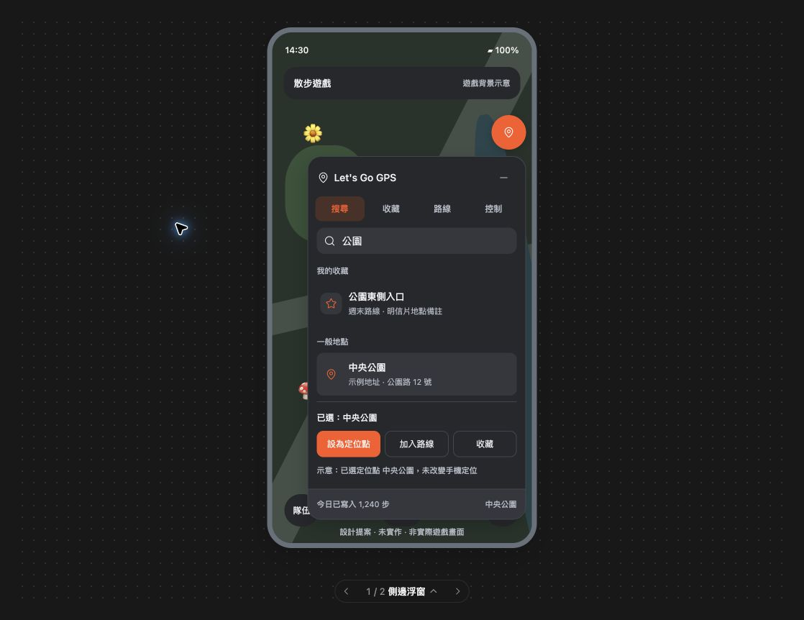

# → Ask / A-001 (Takeshi Mori)

+ 現在這個專案要使用admob的中介服務，但是之前申請applovin說已經不再開放新戶，那接下來要怎麼提升廣告效益

---

## [RUN-001] Event — 2026-10-07 14:22:39 +0800 (A-001)

- 查核 Google 最新中介與 A/B 文件，檢查現有橫幅及獎勵廣告程式；採直接諮詢路線，未修改產品。

# ← Reply / A-001

* _2026-10-07 14:22:39 +0800 (gpt-6.1-sol/low)_

## [SUMMARY]

- 建議保留 AdMob，先測試其他 bidding 廣告來源，再改善現有廣告呈現與載入；AppLovin 無法開戶不會阻止這條路。

## [FINAL REPORT]

1. 「現在這個專案要使用admob的中介服務，但是之前申請applovin說已經不再開放新戶，那接下來要怎麼提升廣告效益」

   - **建議：保留 AdMob 中介，從一個可核准的 bidding 來源開始測試。** AppLovin 是其中一個廣告來源，沒有它仍可做中介。未找到官方公開公告足以證實「全面停止新戶」；以你收到的拒絕通知為目前帳戶限制，不必等待它。
   - **可申請的候選：Unity Ads、Mintegral、Pangle。** Google 的新一代 SDK 中介清單列有這些來源，但清單不代表保證開戶、支援所有市場或一定提高收益。先確認是否接受你的 GPS 工具類 App、主要用戶國家與所需廣告格式；Pangle 要額外確認區域來源配置。[Google 支援清單](https://developers.google.com/admob/android/next-gen/mediation/choose-networks)、[bidding 合作設定](https://support.google.com/admob/answer/9842838)。
   - **先查後台能直接申請的免第三方 SDK bidding 來源。** Google 清單也列有這類來源，可降低接入成本；仍需合作核准與格式支援，不是勾選就一定開始供應廣告。是否先採用，取決於你的後台可用選項。
   - **專案現況：**使用 Next-Gen SDK 1.2.1，目前 Gradle 未看到第三方 mediation adapter；橫幅採固定 AdSize.BANNER 與 50dp 容器，載入失敗回呼沒有記錄；獎勵廣告已有預載與關閉後再載入，但失敗後未看到自動退避重試。程式檢查不能確認 AdMob 後台是否已配置免 SDK 來源。
   - **程式改善順序：**先補載入錯誤、展示與獎勵完成的統計，再測試自適應橫幅並同步調整容器高度；獎勵廣告評估有限次退避重試與可用狀態提示。這些是待測的改善方向，尚未修改程式，也不能保證收益增幅。接第三方 adapter 時要依 Next-Gen 文件核對版本，並驗證初始化與實際供應。[中介接入文件](https://developers.google.com/admob/android/next-gen/mediation)。
   - **驗證收益：**先整理最近 28 天、按國家及廣告格式拆分的收益、請求數、match rate、show rate、eCPM；新增一個來源後做 A/B 比較。主指標用每位每日活躍用戶廣告收益（ARPDAU），並看留存、載入等待與訂閱轉換，避免單看 eCPM。Google 建議一次改一個設定、至少測兩週，且需至少 10,000 次廣告請求才可判定結果；這是最低要求，不保證足夠統計把握。[官方 A/B 測試說明](https://support.google.com/admob/answer/9572326?hl=en-GB)。
   - **不要先大幅拉高底價或增加強制插頁。**例如原本 10,000 次曝光、eCPM $1，收益 $10；提高底價後只剩 4,000 次曝光、eCPM $2，收益反而 $8。GPS 工具操作頻繁，建議先改善現有橫幅與使用者主動觀看的獎勵廣告，再評估新的打斷型版位。
   - **下一步需要的資料：**近 28 天 DAU、前三大用戶國家及比例、橫幅與獎勵廣告各自的收益／請求數／match rate／show rate／eCPM；可貼數值即可。有這些資料才能判斷應優先補供應、改善展示，或提升廣告需求競爭。
   - 本輪完成官方資料查核與本地程式唯讀檢查；未改 App、未操作廣告後台，未跑 Gradle 驗證，因本輪是諮詢。Git fetch 成功，close 前檢查只見既有未追蹤工作流程檔案。

## Questions (batched — each with a suggested default)

- None.


---

# → Ask / A-002 (Takeshi Mori)

+ 好，保留AdMob，你來幫我處理其他競價與優化現有廣告，你有需要什麼資料嗎？還是你自己登入到admob看資料

---

## [RUN-001] Event — 2026-10-07 14:41:04 +0800 (A-002)

- 已授權保留 AdMob、增加競價與改善既有廣告；採先讀後台與現況的路線。
- AdMob 網站存取遭瀏覽器權限政策拒絕，不改用其他途徑繞過；已請使用者提供 28 天報表及核准來源。
- Git preflight：branch main；status 為 main...origin/main、M .agentflow/devlog.md、?? ag.json；fetch 成功；origin/main d175081da672859136769bee5e05a69b25bfefec。
- origin/main 最近五筆：d175081 docs: 記錄 AdMob 中介與收益優化建議；584f3fe Merge pull request #57 from moooo-works/chore/bump-version-1.3.4；ce0cee3 chore: bump version to 1.3.4；86891c8 Merge pull request #56 from moooo-works/fix/health-connect-guidance-refresh；103aa03 fix: refresh Health Connect step sync guidance。
- origin/main:AGENTS.md 已確認存在，ls -la AGENTS.md 顯示正常檔案。產品尚未修改；已啟動 test 基線，Gradle 首次下載中。
- 已詢問 streams: ask 的工作區選擇；待回覆前先查 SDK 文件與執行唯讀檢查。

## [RUN-002] Event — 2026-10-07 14:43:11 +0800 (A-002)

- 完成 SDK 官方文件查核；基線測試尚在下載，已終止並確認 exit 143。未改產品，保留原實作授權與待辦。

# ← Reply / A-002

* _2026-10-07 14:43:11 +0800 (gpt-6.1-sol/low)_

## [SUMMARY]

- 已確認程式與接入需求；競價配置及廣告優化尚未實作，等待報表、核准來源與工作區選擇。AdMob 讀取遭瀏覽器權限拒絕。

## [FINAL REPORT]

1. 「好，保留AdMob，你來幫我處理其他競價與優化現有廣告，你有需要什麼資料嗎？還是你自己登入到admob看資料」

   - 已接受保留 AdMob、增加競價與優化現有廣告的實作授權；工作仍未完成。本輪未修改產品、未建立合作、未操作中介配置。
   - 已找到既有 AdMob 瀏覽器分頁，但綁定該分頁遭自動權限檢查拒絕，理由是使用者未允許這次網站存取；沒有繞過拒絕。請提供報表，無須提供帳號密碼。
   - 所需資料：最近 28 天按國家與廣告格式拆分的收益、請求數、曝光數、eCPM、match rate、show rate，以及已核准第三方來源。DAU 可另外提供；若無核准來源，填尚無。
   - 第三方接入還需要實際平台識別碼；例如 Unity bidding 需要 Game ID 和 Placement ID。建立合作時的法律條款需由使用者在具體步驟確認，不能將本次概括授權視為同意條款。[Google Unity 接入說明](https://developers.google.com/admob/android/next-gen/mediation/unity)。
   - 現有廣告可先改善自適應橫幅與容器高度、載入診斷、獎勵廣告有限次重試；不需要等報表才能開發這部分。需避免與後台橫幅自動刷新重複重試。[Google 橫幅文件](https://developers.google.com/admob/android/next-gen/banner)。
   - 開發工作區仍待選擇。依 [agentflow streams 規範](/Users/mori/.agents/skills/agentflow/references/streams.md)「streams: always proceeds for plain feature/parallel triggers; ask batches the same question」，現有設定 streams: ask，因此在選擇前未開工作區或改產品。
   - Git preflight 完整輸出：
     ```text
     $ git rev-parse --abbrev-ref HEAD
     main
     $ git status --short --branch
     ## main...origin/main
      M .agentflow/devlog.md
     ?? ag.json
     $ git fetch origin --prune
     (exit 0; no output)
     $ git rev-parse origin/main
     d175081da672859136769bee5e05a69b25bfefec
     $ git log --oneline -5 origin/main
     d175081 docs: 記錄 AdMob 中介與收益優化建議
     584f3fe Merge pull request #57 from moooo-works/chore/bump-version-1.3.4
     ce0cee3 chore: bump version to 1.3.4
     86891c8 Merge pull request #56 from moooo-works/fix/health-connect-guidance-refresh
     103aa03 fix: refresh Health Connect step sync guidance
     ```
   - 已確認 origin/main 的 AGENTS.md 與本地 AGENTS.md 存在。./gradlew test 停留在首次下載 Gradle 9.3.1，等待決策期間已終止該下載程序（exit 143），没有測試通過證據；lintDebug、assembleDebug 未執行。尚無 PR 或合併要求。
   - 下一步沿用既有實作授權：收到工作區選擇後建立最新 main 上的 feature 分支，完成現有廣告改善及必跑驗證；收到報表與核准來源後完成對應競價接入。未核准來源保留待申請，不能聲稱開始供應。

## Questions (batched — each with a suggested default)

1. 廣告優化要使用目前 checkout 的新 feature 分支，或建立獨立工作區？
   - Suggested default: 使用目前 checkout 的新 feature 分支。
   - ans:

2. 請提供上述最近 28 天報表數值與目前已核准競價來源。
   - Suggested default: 匯出按國家及廣告格式拆分的報表；無核准來源填尚無。
   - ans:

---

# → Ask / A-003 (Takeshi Mori)

+ 目前 checkout 的新 feature 分支
  報表你看一下能不能操控瀏覽器來下載

+ 我開啟權限了

+ /Users/mori/Downloads/admob-report.csv

+ <send_user_message_question_reply>
  [{"answer":"/Users/mori/Downloads/admob-report\\ \\(1\\).csv\n尚無","question":"這份 CSV 只有 App 總計。請補充報表日期範圍，並匯出按「國家＋廣告格式」拆分的同期間報表；另外，目前 Unity Ads、Mintegral、Pangle 等是否有已核准帳戶？沒有可直接填「尚無」。","questionItemId":"[\"request_user_input_async\",\"call_b139b5373d9b4110ba8fe959c6b0fb08\",0]"}]
  </send_user_message_question_reply>

---

## [RUN-001] Event — 2026-10-07 14:49:51 +0800 (A-003)

- 沿用 A-002 實作授權，使用者已選目前 checkout 的新 feature 分支；從 origin/main fb49d2fb1456716d44d98e6d9db05f3b104f424e 建立 feat/admob-ad-optimization，保留本輪筆記與未追蹤 ag.json，未 reset dirty files。
- Preflight branch main；status main...origin/main、M .agentflow/devlog.md、?? ag.json；fetch exit 0；origin/main fb49d2fb1456716d44d98e6d9db05f3b104f424e；最近五筆 fb49d2f、d175081、584f3fe、ce0cee3、86891c8。origin/main:AGENTS.md 與 ls -la AGENTS.md 已確認。
- 使用者表示已開權限後再次讀取 AdMob，仍被 saved preference blocks it 拒絕；沒有改用其他介面。T-2/T-3 等待網站權限生效或 CSV 與核准來源。
- 直接實作路線限現有廣告改善；不增加未核准 SDK，不建立資料上傳管道。追蹤表 .agentflow/artifacts/A-003-admob/tracker.md 已驗證。
- 新增獎勵廣告重試的三個測試：延遲與上限、手動 preload 取消重複重試、成功後重設。
- 官方 Gradle 下載緩慢，停止兩個本輪下載程序，改同一官方檔案分段下載並以官方 SHA-256 驗證；產品 Gradle 設定不變。

## [RUN-002] Event — 2026-10-07 14:52:20 +0800 (A-003)

- 官方 Gradle 9.3.1 分段下載完成，SHA-256 b266d5ff6b90eada6dc3b20cb090e3731302e553a27c5d3e4df1f0d76beaff06 已驗證並安裝本機 wrapper cache；使用 Android Studio Java 21。
- 首次 focused test 因 MAPS_API_KEY 未設定而停在 configuration。已用命令範圍 MAPS_API_KEY=build-validation-placeholder 修正驗證環境；不保存金鑰、不改設定、不代表能實際載入地圖。
- focused test 正安裝缺少的 SDK 平台與 Build-Tools，之後會驗證新增測試在舊實作上失敗。現有 diff 僅筆記、tracker 與 RewardedAdManagerTest.kt，符合 T-1。

## [WIP-001] Checkpoint — 2026-10-07 14:53:40 +0800 (A-003)

- **Finished:** 新 feature 分支與 Git preflight；官方 Gradle 校驗；新增三個重試測試；AdMob 權限重試仍被封鎖。
- **Running now:** focused test 首次編譯與下載依賴，尚未得到失敗測試結果。
- **Still to do:** 最小廣告實作、完整 test/lintDebug/assembleDebug、獨立審查；後台報表與競價來源仍待使用者。
- **Next work action:** 確認新增測試在舊實作上失敗後，加入有限次重試與自適應橫幅。
- **Checks:** [x] tracker.md | [x] devlog RUN | [x] scope matches tracker

## [RUN-003] Event — 2026-10-07 14:56:27 +0800 (A-003)

- 新增測試在舊實作上執行：12 個、2 個失敗，證明缺少自動重試與成功後重設；失敗不是編譯或環境錯誤。
- 最小實作已完成：獎勵載入失敗後依 5/15/30 秒最多重試三次，手動 preload 取消排程；增加本機錯誤碼與曝光事件診斷。橫幅依可視容器寬度選取較小 anchored adaptive 尺寸、同步高度，寬度/方向變更釋放舊 AdView；改用 adaptive 測試版位。
- ./gradlew test 成功；XML 合計 251 tests、0 failures、0 errors、66 skipped（實際執行 185）。三個新增重試案例及原獎勵流程均通過。
- 使用者提供的 Downloads/admob-report.csv 已唯讀分析，UTF-16 tab 分隔、只有應用程式總計，缺日期/國家/格式及活躍使用者。私人收益與數值不寫入 Git；CSV 留原位置，未上傳。
- lintDebug 正執行；assembleDebug 與獨立審查待完成。adb devices 無連線裝置，實機 smoke test 待補。

## [RUN-004] Event — 2026-10-07 14:59:53 +0800 (A-003)

- lintDebug 與 assembleDebug 命令成功。lint 報告 34 errors、91 warnings、3 hints；errors 都位於未改檔案，廣告修改檔案無列出問題。abortOnError=false 代表命令成功不等於 lint 零錯誤。
- 產品提交 bb58f9a1244f8ce6c1d32cd39ae532c15157ad27；4 個產品檔案、197 行增刪，git diff --check 通過。審查 planner 判定 targeted。
- 依技能要求使用 native 獨立審查 /root/ad_review，fork_turns=none、模型繼承；權限共享、唯讀僅指示未技術強制。審查只可寫 review.md，復用本輪驗證證據，禁止讀私人 CSV；coordinator 保留驗收。
- 後台媒合來源與實際競價尚未接入，不能聲稱收益提高。CSV 缺少日期、國家與格式，已請使用者補同期間分群報表及核准帳戶。

## [RUN-005] Event — 2026-10-07 15:04:48 +0800 (A-003)

- 已驗收 native 審查報告，指定 bb58f9a commit、Outcome/Minimality/Conformance/Verdict 全 PASS；主審讀回 report 並確認僅授權記錄新增，產品未再變更。
- 已唯讀分析第二份國家/格式 CSV；以欄位重算加權媒合/顯示率，不直接平均百分比。台灣為主要流量，橫幅供應應優先測試；獎勵廣告的低顯示率含預載未使用，不能直接當成故障。日期仍缺，未推算每日收益；两份報表有小幅總計差異，後續比較需統一期間與導出時間。
- 使用者確認尚無第三方核准帳戶。建議先申請 Mintegral 作為測試來源，核准後只加一個來源做對照；這是申請/驗證順序而非收益排名。查閱 Google 官方接入文件，Mintegral 支援所需格式及 bidding。
- 查看 dev.mintegral.com 申請頁亦遭瀏覽器政策拒絕，理由 user declined permission；未改用其他途徑。申請需使用者本人先完成；AdMob mapping 與 adapter 仍待核准。
- feature 已 push；私人 CSV 與收益數字未進 Git，ag.json 未提交。準備既有廣告優化 draft PR，無合併要求。

## [RUN-006] Event — 2026-10-07 15:07:59 +0800 (A-003)

- PR #58 已確認 isDraft=true、base=main、head=feat/admob-ad-optimization；已檢查所有最終變更路徑、Git diff check、審查報告與 tracker，2/3 任務完成，競價待核准。

# ← Reply / A-003

* _2026-10-07 15:07:59 +0800 (gpt-6.1-sol/low)_

## [SUMMARY]

- 已從最新 main 建立 feat/admob-ad-optimization，現有廣告優化完成並交付草稿 PR #58；瀏覽器下載被政策拒絕，改讀使用者提供的 CSV。

- 使用者開權限後重試仍被儲存偏好封鎖，沒有繞過。

- 第一份 CSV 已讀取，只有 App 總計；分析改以後續分群資料為準，不把私人收益提交 Git。

- 第二份 CSV 已完成分群分析；優先測台灣橫幅的新競價來源。尚無核准帳戶，建議先申請 Mintegral，競價接入仍待核准。

## [FINAL REPORT]

1. 「目前 checkout 的新 feature 分支
   報表你看一下能不能操控瀏覽器來下載」

   - **現有廣告優化完成：**[草稿 PR #58](https://github.com/moooo-works/Lets-go-gps/pull/58)，feature 分支 feat/admob-ad-optimization。產品 commit bb58f9a1244f8ce6c1d32cd39ae532c15157ad27。自適應橫幅依可視容器寬度請求廣告，保留相符高度，宽度或方向改變時釋放舊 AdView；Debug 改 adaptive 測試版位。

   - **獎勵廣告改善：**載入失敗後依 5、15、30 秒最多自動重試三次；手動預載取消排程，成功後重設。保留一次性獎勵及關閉後預載。新增本機載入錯誤码／曝光／獎勵事件診斷，沒有新增 Analytics 上傳或未核准 adapter。

   - **驗證：**./gradlew test、./gradlew lintDebug、./gradlew assembleDebug 命令成功。test XML 共 251 項、185 實際執行、66 skipped、0 failures、0 errors；新增重試案例先在舊實作出現 2 個預期 assertion failures，再修正通過。lint 設定 abortOnError=false，仍有 34 errors／91 warnings／3 hints，errors 位於未改檔案，廣告修改檔案無列出問題；不能稱全專案 lint 乾淨。

   - **審查與限制：**已讀回獨立審查報告，指定產品 commit 的 Outcome、Minimality、Conformance 全 PASS。沒有連線裝置，實機 smoke test（mock app、冷啟動設定防誤觸、四項 Map UX、橫幅旋轉及獎勵流程）由提交者發布前補測。建置使用 Android Studio Java 21 與命令範圍 Maps key 占位值，實際地圖載入未驗證。尚未要求合併，沒有收益增加證據。

   - **Git preflight：**
     ```text
     $ git rev-parse --abbrev-ref HEAD
     main
     $ git status --short --branch
     ## main...origin/main
      M .agentflow/devlog.md
     ?? ag.json
     $ git fetch origin --prune
     (exit 0; no output)
     $ git rev-parse origin/main
     fb49d2fb1456716d44d98e6d9db05f3b104f424e
     $ git log --oneline -5 origin/main
     fb49d2f docs: 記錄廣告優化前置檢查與待補資料
     d175081 docs: 記錄 AdMob 中介與收益優化建議
     584f3fe Merge pull request #57 from moooo-works/chore/bump-version-1.3.4
     ce0cee3 chore: bump version to 1.3.4
     86891c8 Merge pull request #56 from moooo-works/fix/health-connect-guidance-refresh
     ```

   - 已確認 origin/main:AGENTS.md 與本地檔案存在，直接從最新 origin/main 開分支，保留本輪筆記與既有 ag.json；沒有對 dirty files 做 reset。GitHub compare API 回傳 ahead_by=1、behind_by=0、status=ahead；PR 指向 main 且 isDraft=true。

   - **Key Records — read these first**

     [草稿 PR #58](https://github.com/moooo-works/Lets-go-gps/pull/58) 包含程式改動、驗證與實機待補項目。

     [獨立審查報告](artifacts/A-003-admob/review.md) 說明指定產品 commit 的受影響流程與限制。

     [工作追蹤](artifacts/A-003-admob/tracker.md) 保留尚未完成的競價接入與下一步。

2. 「我開啟權限了」

   - 已重新嘗試 AdMob 分頁；自動權限檢查仍拒絕，理由是 saved user permission setting blocks this action。未使用其他表面或 API 繞過。後續以你提供的 CSV 完成分析，但瀏覽器自行下載未成功。

3. 「/Users/mori/Downloads/admob-report.csv」

   - 已唯讀讀取 UTF-16、tab 分隔的原檔；只有應用程式總計，無日期、國家、格式，活躍使用者欄位為空，不能推算每日收益或 ARPDAU。初步加權計算已與曝光／請求／收益定義核對。

   - CSV 留在 Downloads，沒有上傳或提交；私人收益與百分比不寫入 Git。本輪完整分析的原始輸入可在 [原總計 CSV](/Users/mori/Downloads/admob-report.csv) 與後續分群檔核對。以後續分群檔作目前判斷，不混用兩次匯出的小幅總計差異。

4. 「/Users/mori/Downloads/admob-report\ \(1\).csv
   尚無」

   - 已讀取實際路徑 [分群 CSV](</Users/mori/Downloads/admob-report (1).csv>)，104 筆國家／格式資料，重算曝光／媒合請求及加權率；未直接平均百分比。**優先處理台灣橫幅供應。**獎勵廣告主要市場的媒合已接近完整；低顯示率包括預載未使用，不能直接當成故障，更不能因此強迫看廣告。新增重試能改善暫時載入失敗，但不宣稱能解決這份報表的主要收益問題。

   - 兩份 CSV 的請求總計相同，但曝光與逐列四捨五入的收益有小幅差異；不能判定全部差異原因。報表缺日期，還需起迄日期供後續同期間對照；不推算每日或月收益。

   - **競價仍未完成：**你已確認尚無核准帳戶。建議先申請 [Mintegral 發布者帳戶](https://dev.mintegral.com)，作第一個待核准測試來源。Google 文件列出 Android bidding 與橫幅／獎勵格式接入；這是可接入候選，不能證明對你的台灣流量一定較高收益。[官方接入說明](https://developers.google.com/admob/android/next-gen/mediation/mintegral)。

   - 本機嘗試查看 Mintegral 申請頁也被自動權限檢查拒絕，理由是 user declined permission。你需先自行完成帳戶申請與條款確認；核准後沿用 A-002 的既有授權接 SDK／adapter、AdMob mapping、測試供應，再一次只加一個來源做 A/B 對照。網站權限仍需可用，不能聲稱已開始供應。

   - 現有廣告程式與報表分析已交付；帳戶申請、第三方競價、真實廣告 smoke test 與收益對照尚未完成，沒有背景工作在執行。

## Questions (batched — each with a suggested default)

1. 請補兩份 CSV 的報表起迄日期。
   - Suggested default: 回覆 AdMob 匯出時選擇的日期範圍；不要從檔案下載日期推定。
   - ans:

---

# → Ask / A-004 (Takeshi Mori)

+ 自動權限檢查在哪裡修改？

---

## [RUN-001] Event — 2026-10-07 15:19:27 +0800 (A-004)

- 已用 OpenAI Docs 官方文件確認 Browser 與 Computer Use → Edge Manage 的網站允許／封鎖名單；本輪只說明，未修改權限。

# ← Reply / A-004

* _2026-10-07 15:19:27 +0800 (gpt-6.1-sol/low)_

## [SUMMARY]

- 在桌面 App 的設定 → Browser 管理網站封鎖；外部 Edge 的入口也可能是 Computer Use → Edge → Manage。

## [FINAL REPORT]

1. 「自動權限檢查在哪裡修改？」

   - 已使用 OpenAI Docs 查核官方文件。開桌面 App 的 **設定 → Browser（瀏覽器）**，管理允許／封鎖網站；可用 [直接開啟瀏覽器設定](codex://settings/browser-use)。[官方設定文件](https://learn.chatgpt.com/docs/reference/settings)、[官方設定連結](https://learn.chatgpt.com/docs/reference/commands)。

   - 我們使用外部 Edge。若畫面顯示 **Computer Use（電腦使用）**，進入並點 **Edge 旁的 Manage（管理）**；在封鎖名單移除 **admob.google.com** 與 **dev.mintegral.com**。這會讓工具重新詢問網站存取，下次提示選 **Allow for this site（允許此網站）**。只開啟 Edge 開關不會移除封鎖名單。[官方說明](https://learn.chatgpt.com/docs/chrome-extension)。

   - 完成後回覆「已移除封鎖」即可沿用既有授權重試。若仍被拒絕，再重啟瀏覽器或桌面 App；官方也列出新對話可清除連線狀態，但不是保證必須重啟。[官方排解方式](https://learn.chatgpt.com/docs/chrome-extension)。

   - 本輪未代改設定、未重試受封鎖網站，亦未修改產品。草稿 PR #58 與 A-003 的待辦保留：Mintegral 帳戶核准、第三方競價、報表日期與實機測試尚待完成。

## Questions (batched — each with a suggested default)

- None.


---

# → Ask / A-005 (Takeshi Mori)

+ [Image #1] 這樣可以了嗎

---

## [RUN-001] Event — 2026-10-07 15:31:08 +0800 (A-005)

- 截圖顯示 AdMob、Mintegral 瀏覽權限皆為一律允許，下載需核准；重試 AdMob 仍回 saved user permission setting blocks this action，設定畫面與工具執行狀態不一致。未繞過。

# ← Reply / A-005

* _2026-10-07 15:31:08 +0800 (gpt-6.1-sol/low)_

## [SUMMARY]

- 截圖設定正確，但本工作階段重試 AdMob 仍被政策拒絕；建議重新啟動桌面 App 與 Edge 後重試。

## [FINAL REPORT]

1. 「[Image #1] 這樣可以了嗎」

   - **設定看起來正確：**AdMob 與 Mintegral 的「瀏覽中」都是「一律允許」；「下載項目」保留「需要核准」可以，下載時再處理提示。

   - **尚未生效到這次工具呼叫：**我已重試 AdMob，仍被自動權限檢查拒絕，理由是 saved user permission setting blocks this action。不能把畫面設定正確當成實際存取已成功，也不能確定兩者不一致的原因。

   - 先重新啟動 Codex／ChatGPT 桌面 App 與 Edge，再回覆讓我重試。若仍不行，可在新對話延續本專案；官方排解文件列有重啟瀏覽器、桌面 App 與新對話以清除連線狀態，並不保證必須重啟或能解決所有權限問題。[官方排解文件](https://learn.chatgpt.com/docs/chrome-extension)。

   - 本輪未修改權限或產品。第三方競價仍待可用網站權限与發布者帳戶核准；現有廣告優化維持草稿 PR #58。

## Questions (batched — each with a suggested default)

- None.


---

# → Ask / A-006 (Takeshi Mori)

+ 已重啟

---

## [RUN-001] Event — 2026-10-07 15:34:36 +0800 (A-006)

- 重啟後原 browser 1 unavailable；getState 無 apps/browsers 並回 Sky Computer Use native pipe startup failed。已 reset cua kernel 並重新初始化，結果相同；尚未到網站存取檢查。

# ← Reply / A-006

* _2026-10-07 15:34:36 +0800 (gpt-6.1-sol/low)_

## [SUMMARY]

- 已重試，但重啟後工具沒有任何瀏覽器連線；需先確認 Edge 擴充功能連線，再使用 @Edge 重新綁定。

## [FINAL REPORT]

1. 「已重啟」

   - 已重試原 AdMob 分頁，回 Browser is not available: 1；重新取得狀態時 apps=[]、browsers=[]，錯誤為 Sky Computer Use native pipe startup failed。已重置工具 kernel 並重新初始化一次，仍相同。這次未到網站存取檢查，無法判斷先前網站封鎖是否已解除。

   - 請先在 Edge 確認 ChatGPT 擴充功能已啟用，回到桌面 App 的設定 → Computer Use 確認 Edge 顯示 Manage／管理；再於此對話用 @Edge 選取目前瀏覽器，讓我重新綁定。若工具仍未連線，可在同專案開新對話並 @Edge。[官方擴充功能連線與排解文件](https://learn.chatgpt.com/docs/chrome-extension)。

   - 本輪未改 App、網站權限或廣告後台。現有廣告優化保留於草稿 PR #58；報表分析已完成，第三方競價仍待可用瀏覽器連線與帳戶核准，報表日期與實機待補。沒有背景程序執行。

## Questions (batched — each with a suggested default)

- None.


---

# → Ask / A-007 (Takeshi Mori)

+ 試試看

---

## [RUN-001] Event — 2026-10-07 15:36:56 +0800 (A-007)

- 再次 getState 仍無 apps/browsers，回 Sky Computer Use native pipe startup failed；工具連線尚未恢復，未讀取任何 AdMob 頁面。

# ← Reply / A-007

* _2026-10-07 15:36:56 +0800 (gpt-6.1-sol/low)_

## [SUMMARY]

- 重試仍失敗，Browser/Computer Use 工具連線尚未恢復；建議在同專案新對話 @Edge 重建連線。

## [FINAL REPORT]

1. 「試試看」

   - 已再嘗試 cua.getState，仍回 apps=[]、browsers=[] 及 Sky Computer Use native pipe startup failed。沒有取得任何瀏覽器或 AdMob 畫面，也無法判定網站權限現在是否可用。

   - 建議在同一專案開新對話，選 @Edge，並送出「接續廣告優化，先確認 Edge／AdMob 連線；既有草稿 PR #58，工作紀錄在 .agentflow/devlog.md」。官方文件列出新對話可清除對話連線狀態，但不能保證修復此啟動錯誤。[官方排解文件](https://learn.chatgpt.com/docs/chrome-extension)。

   - 已完成的程式與報表分析保留；沒有改權限或產品，也沒有背景工作。第三方競價仍待工具連線與帳戶核准，實機及報表日期待補。

## Questions (batched — each with a suggested default)

- None.


---

# → Ask / A-008 (Takeshi Mori)

+ @Computer-Use 接續廣告優化，先確認 Edge／AdMob 連線。草稿 PR #58，工作紀錄在 .agentflow/devlog.md。

---

## [RUN-001] Event — 2026-10-07 15:40:32 +0800 (A-008)

- Edge／AdMob 連線成功，已讀取登入後報表與中介配置；群組只有 AdMob 預設，AppLovin 有效合作關係但本 App 對應為 0。未改後台或產品。

# ← Reply / A-008

* _2026-10-07 15:40:32 +0800 (gpt-6.1-sol/low)_

## [SUMMARY]

- Edge／AdMob 已恢復連線；AppLovin 顯示有效合作關係，但 Let's Go 尚無廣告單元對應。

## [FINAL REPORT]

1. 「@Computer-Use 接續廣告優化，先確認 Edge／AdMob 連線。草稿 PR #58，工作紀錄在 .agentflow/devlog.md。」

   - 成功讀取登入後的報表、中介群組與出價來源頁，先前連線及網站存取障礙本次未再出現。

   - 群組清單只有 AdMob (預設)。AppLovin 顯示有效的合作夥伴關係，但 Let's Go 的廣告單元對應為 0，顯示尚未對應任何廣告單元；不能認定已核准發布者帳戶或開始供應廣告。下一步確認來源帳戶可用狀態與識別碼，再沿用既有接入授權。

   - 未修改後台或產品，未跑 Gradle；草稿 PR #58 保留。第三方競價、報表日期與實機測試仍待補，沒有背景工作執行。

## Questions (batched — each with a suggested default)

- None.

---

# → Ask / A-009 (Takeshi Mori)

+ 進行廣告優化

---

## [RUN-001] Event — 2026-10-07 15:51:14 +0800 (A-009)

- 採直接路線，沿用既有廣告接入授權；查看來源清單與 Mintegral 啟用步驟，尚未接受條款或儲存。Computer Use 法律條款確認已送出，待使用者回覆。
- Mintegral 登入頁可開啟但畫面空白，重新載入一次仍空白，未建立帳戶。官方接入文件要求 App Key、App ID、Placement ID、Ad Unit ID，核准及資料仍待補。
- Git preflight：feat/admob-ad-optimization；status 僅 M .agentflow/devlog.md、?? ag.json；fetch 成功；origin/main 7ba0326cf97f5f85d00e615faec3d8d71ac18c66；最近五筆 7ba0326、81db489、137e2e6、ac3289f、54261b9。origin/main 含 AGENTS.md，本地 ls 已確認。main...HEAD behind=0、ahead=7；PR #58 OPEN/draft。
- 為讓 root 筆記回到 main 正常提交，切回 main 並 merge --ff-only origin/main（Already up to date），保留所有本輪紀錄及未追蹤 ag.json；未 reset 或改產品。

# ← Reply / A-009

* _2026-10-07 15:51:14 +0800 (gpt-6.1-sol/low)_

## [SUMMARY]

- 已推進至 Mintegral 出價條款確認；接入尚未完成，待你確認條款與可用發布者帳戶。

## [FINAL REPORT]

1. 「進行廣告優化」

   - 已查閱 AdMob 可用來源並進到 Mintegral 啟用步驟，保留畫面等待具體確認。此步驟須接受出價條款，允許 Google 向買方揭露廣告版位、App 與帳戶資料，包含組織名稱及付款聯絡人姓名；另載有直接付款來源及不得依即時價格動態分配請求的約定。依 Computer Use 的法律條款確認要求，未收到本次確認前不能按「確認並同意」或儲存。已送出確認問題，未替你接受。

   - Mintegral 登入入口可開啟，但畫面空白，重載一次仍相同；未建立或核准發布者帳戶。完整接入還需 App Key、App ID、Placement ID、Ad Unit ID、SDK／adapter 及實際測試供應，啟用 AdMob 來源本身不代表廣告開始供應。[Google 官方接入說明](https://developers.google.com/admob/android/next-gen/mediation/mintegral)。

   - 既有自適應橫幅、載入診斷與獎勵廣告有限重試已交付草稿 PR #58，本輪未新增產品改動或未核准 adapter，未重跑 Gradle。沒有新增收益或真實供應驗證證據，沒有背景程序執行。

   - Git preflight 輸出：

     ```text
     branch: feat/admob-ad-optimization
     status: ## feat/admob-ad-optimization...origin/feat/admob-ad-optimization
      M .agentflow/devlog.md
     ?? ag.json
     git fetch origin --prune: exit 0
     origin/main: 7ba0326cf97f5f85d00e615faec3d8d71ac18c66
     7ba0326 docs: 記錄瀏覽器重試結果與接續方式
     81db489 docs: 記錄重啟後瀏覽器連線故障
     137e2e6 docs: 記錄網站權限畫面與工具狀態差異
     ac3289f docs: 說明瀏覽器網站權限管理入口
     54261b9 docs: 保存廣告優化審查與競價追蹤
     origin/main...HEAD: behind 0 / ahead 7
     ```

   - 已切回最新 main 保存 root 工作紀錄，保留 feature 與草稿 PR；未要求合併。

## Questions (batched — each with a suggested default)

1. 是否同意我現在在 AdMob 按 Mintegral「確認並同意」並儲存上述出價條款？

   - Suggested default: 先閱讀目前保留的條款畫面，再明確回覆同意或暫不啟用；不預設同意。

   - ans:

---

# → Ask / A-010 (Takeshi Mori)

+ 同意並儲存

---

## [RUN-001] Event — 2026-10-07 15:53:42 +0800 (A-010)

- 依本次明確授權按 Mintegral 確認並同意；網站直接保存合作關係並進入 mapping。因缺 App Key／App ID／Placement ID／Ad Unit ID，mapping 儲存按鈕 disabled，取消空白 mapping 後讀回來源：Mintegral 有效的合作夥伴關係，Let's Go 對應 0。
- 保存結果截圖 /private/tmp/mintegral-enabled.jpg；未新增 mapping 或修改 App。

# ← Reply / A-010

* _2026-10-07 15:53:42 +0800 (gpt-6.1-sol/low)_

## [SUMMARY]

- Mintegral 出價條款已接受並由網站保存，來源顯示有效合作關係；廣告單元對應仍待帳戶及版位資料。

## [FINAL REPORT]

1. 「同意並儲存」

   - 已成功按「確認並同意」，網站直接保存並進入廣告單元對應頁；返回來源清單確認 Mintegral 已新增且顯示「有效的合作夥伴關係」。

   - mapping 的儲存按鈕因識別碼未填而停用；未儲存空白對應。Let's Go 對應仍為 0，尚未接入實際廣告供應。下一步需核准的 Mintegral 帳戶，以及 App Key、App ID、橫幅與獎勵版位各自的 Placement ID／Ad Unit ID；不要在聊天貼帳戶密碼。

   - 未修改 App，沒有背景工作；既有 PR #58 保留。結果截圖：

     

## Questions (batched — each with a suggested default)

- None.

---

# → Ask / A-011 (Takeshi Mori)

+ 再來怎麼處理？你來完成廣告優化的事情

---

## [RUN-001] Event — 2026-10-07 16:00:24 +0800 (A-011)

- 沿用既有接入授權，直接檢查 Mintegral 登入頁；DOM snapshot 空白、AX 無欄位、截圖全白，console 沒有可用錯誤。依 Google 官方接入頁的 signup 連結開 /user/signup，仍無欄位。非政策拒絕，無法判定空白根因。
- 保留 signup 分頁等待使用者自行確認顯示／登入；已送出帳戶可用狀態問題。沒有新增來源條款確認、mapping、SDK 或宣稱供應成功。

# ← Reply / A-011

* _2026-10-07 16:00:24 +0800 (gpt-6.1-sol/low)_

## [SUMMARY]

- 完整接入仍在進行範圍內，但 Mintegral 登入與官方申請頁都空白；需先恢復帳戶入口，才能取得版位資料。

## [FINAL REPORT]

1. 「再來怎麼處理？你來完成廣告優化的事情」

   - 已承接後續完整工作：建立 Let's Go 橫幅／獎勵版位，配置 AdMob 對應與中介群組，接入相容 SDK／adapter，執行 test、lintDebug、assembleDebug，再驗證實際廣告供應。這些授權保留，不需要每一步重新確認；若新帳戶需設定密碼或接受另一份法律條款，才在實際步驟交由你處理或確認。

   - **目前阻礙：**Mintegral 登入頁與 Google 文件連出的官方申請頁都空白。登入頁的 DOM、AX 與截圖均無欄位；console 無可用錯誤，不能判定根因。已保留 [官方申請頁](https://dev.mintegral.com/user/signup) 供你在 Edge 查看，並詢問手動顯示與帳戶狀態。沒有繞過網站限制或臆造帳戶識別碼。

   - AdMob 合作關係已於上一輪保存，但尚無 Mintegral App Key／App ID／Placement ID／Ad Unit ID，因此 mapping、第三方 adapter 與供應測試未完成。[Google 官方接入說明](https://developers.google.com/admob/android/next-gen/mediation/mintegral)。

   - 既有自適應橫幅與獎勵重試保留 draft PR #58；本輪沒有產品改動，未重跑 Gradle。完整廣告優化尚未完成，沒有背景程序執行，也沒有收益增幅證據。帳戶入口可用後我會接手其餘步驟。

## Questions (batched — each with a suggested default)

1. 你在 Edge 手動開啟 Mintegral 官方申請頁是否正常？若已有帳戶，請自行登入並告知是否核准。

   - Suggested default: 在保留的 signup 分頁確認；若正常可註冊／登入，不在聊天提供密碼。

   - ans:

---

# → Ask / A-012 (Takeshi Mori)

+ 還沒註冊，要選擇廣告主還是發布商？

---

## [RUN-001] Event — 2026-10-07 16:05:21 +0800 (A-012)

- 查核 Mintegral 官方 Monetization 與 advertiser 定義；本 App 展示廣告賺收益應選 Publisher。未操作註冊或修改產品。

# ← Reply / A-012

* _2026-10-07 16:05:21 +0800 (gpt-6.1-sol/low)_

## [SUMMARY]

- 選發布商（Publisher），你要在 Let's Go 顯示廣告並收取收益。

## [FINAL REPORT]

1. 「還沒註冊，要選擇廣告主還是發布商？」

   - **選發布商（Publisher）。**你的用途是在 Let's Go 裡展示其他公司的廣告，賺取廣告收益，屬於 Mintegral 的 App monetization 業務。[官方說明](https://www.mintegral.com/en/monetization)。

   - 廣告主（Advertiser）是付費投放廣告、推廣自己產品的角色。[官方角色定義](https://helpcenter.mintegral.com/en/docs/advertiser-policies)。

   - 使用發布商帳戶完成註冊，帳戶審核通過後我會接續建立 App 與橫幅／獎勵版位、AdMob 對應及 SDK 驗證。註冊完成不等於核准；不要在聊天貼密碼。

## Questions (batched — each with a suggested default)

- None.

---

# → Ask / A-013 (Takeshi Mori)

+ mintegral是哪裡的廣告商？

---

## [RUN-001] Event — 2026-10-07 16:09:14 +0800 (A-013)

- 查核 Mintegral 中文關於頁與 Mobvista 官方公司歷程：Mintegral 為匯量科技旗下平台，母公司在香港上市 01860。本輪僅回答公司背景，未變更廣告配置。

# ← Reply / A-013

* _2026-10-07 16:09:14 +0800 (gpt-6.1-sol/low)_

## [SUMMARY]

- Mintegral 是中國背景的廣告平台，屬於匯量科技（Mobvista），母公司在香港上市。

## [FINAL REPORT]

1. 「mintegral是哪裡的廣告商？」

   - **Mintegral 是中國背景的廣告平台**，隸屬匯量科技（Mobvista）；官方中文網站明確列為匯量科技旗下平台。[Mintegral 官方介紹](https://www.mintegral.com/cn/about-us)。

   - 母公司 Mobvista 在香港聯交所上市，股票代碼 01860；Mintegral 業務涵蓋全球市場。[母公司官方歷程](https://www.mobvista.com/en/about-us)、[Mintegral 全球業務介紹](https://www.mintegral.com/en/about-us)。

   - 本次僅說明背景，沒有新增 SDK 或更改後台；既有 AdMob 合作關係已保存，完整接入仍待發布商帳戶與版位資料。

## Questions (batched — each with a suggested default)

- None.

---

# → Ask / A-014 (Takeshi Mori)

+ 不同廣告平台，給的價格會不一樣嗎？

---

## [RUN-001] Event — 2026-10-07 16:10:16 +0800 (A-014)

- 查核 Google 官方 bidding 與 eCPM 定義，回答平台價格差異與總收益比較；未操作後台或產品。

# ← Reply / A-014

* _2026-10-07 16:10:16 +0800 (gpt-6.1-sol/low)_

## [SUMMARY]

- 會，平台出價會隨廣告需求與流量改變；應以相同條件下的實際收益評估，不能保證 Mintegral 比 AdMob 高。

## [FINAL REPORT]

1. 「不同廣告平台，給的價格會不一樣嗎？」

   - **會，而且同一平台的價格也會變。**不同平台的廣告主與需求不同，使用者國家、廣告格式與時間也會影響收益。常看的 eCPM 是每一千次實際曝光的平均收益，不是固定報價。[Google eCPM 說明](https://support.google.com/admob/answer/15337570?hl=en)。

   - AdMob bidding 讓來源對同一次廣告曝光即時競價。例如假設 Google 出 US$1、Mintegral 出 US$1.40，Mintegral 的競價較高；下一次可能反過來。這些數字只是示例，不是你的實際報價。[官方競價說明](https://support.google.com/admob/answer/9234488?hl=en)。

   - **高單價不一定有較高總收入。**假設 A 的 eCPM 為 US$2，展示 10,000 次，收益 US$20；B 的 eCPM 為 US$4，但只展示 3,000 次，收益 US$12。因此需一起看實際曝光、總收益、載入速度與使用体验。

   - 對 Let's Go，保留 AdMob 並接入核准的新來源，目的是增加競爭與供應；Mintegral 不保證比較貴或提高收入，要在相同國家、格式、期間與相近流量條件下驗證。既有完整接入授權保留，但發布商帳戶、版位對應及真實供應測試仍待完成。

## Questions (batched — each with a suggested default)

- None.

---

# → Ask / A-015 (Takeshi Mori)

+ 我不想使用這家中國背景的廣告平台，看看還有沒有別的

---

## [RUN-001] Event — 2026-10-07 16:12:39 +0800 (A-015)

- 使用者撤回 Mintegral 接入意向，停止該來源的註冊、mapping 與 SDK 工作；既有廣告優化授權改以符合新偏好的來源為範圍。
- 查核 Unity 與 Liftoff 最新 SEC 公司所在地，以及 Google Next-Gen 接入文件：兩者均支援 Android bidding、Banner、Rewarded；候選不代表保證帳戶核准或收益。
- AdMob 唯讀確認 Mintegral 仍有已保存合作關係，但 Let's Go 對應 0，尚未新增 adapter 或接入群組；未宣稱撤銷已接受条款。

# ← Reply / A-015

* _2026-10-07 16:12:39 +0800 (gpt-6.1-sol/low)_

## [SUMMARY]

- 已停止 Mintegral 接入；建議改以美國公司 Unity Ads 為第一候選，Liftoff Monetize 為第二候選。

## [FINAL REPORT]

1. 「我不想使用這家中國背景的廣告平台，看看還有沒有別的」

   - 已排除 Mintegral，停止它的註冊、版位對應與 SDK 接入。先前 AdMob 保存的合作關係仍存在，但 Let's Go 廣告單元對應為 0，沒有 Mintegral adapter 或中介群組接入；不代表已撤銷先前接受的條款。

   - **第一候選：Unity Ads。**Unity Software 是美國公司，總部在加州 San Francisco。[2025 年報](https://www.sec.gov/Archives/edgar/data/1810806/000181080626000011/unity-20251231.htm)。Google Next-Gen 文件列出 Android bidding、橫幅及獎勵支援；不需把 App 改用 Unity 引擎。新接入採 bidding，文件已標示 waterfall 支援於 2026/1/31 結束。[官方接入文件](https://developers.google.com/admob/android/next-gen/mediation/unity)。

   - **第二候選：Liftoff Monetize（原 Vungle）。**Liftoff 在美國 Delaware 註冊，總部位於加州 Redwood City。[2026 季報](https://www.sec.gov/Archives/edgar/data/1850351/000162828026056398/lfto-20260630.htm)。支援本專案 Next-Gen SDK 的 bidding、橫幅與獎勵廣告。[官方接入文件](https://developers.google.com/admob/android/next-gen/mediation/liftoff-monetize)。

   - 我建議先走 Unity Ads，原因是已核對能沿用目前 AdMob 與兩種廣告格式的完整接入流程；這不是收益排名，也不代表保證工具類 App 核准。申請發布商／Monetization 帳戶後，建立 Android 專案，選 Google AdMob 為中介夥伴並使用 bidding 版位，再接 Game ID／Placement ID 與 adapter。尚未建立該帳戶或接受新條款。

   - 公司所在地與控制背景的判斷以目前官方披露為依據，未聲稱所有股東、合作夥伴或資料處理都完全與中國無關。本輪沒有產品改動或新來源啟用，沒有背景工作；PR #58 的既有優化保留。

## Questions (batched — each with a suggested default)

- None.

---

# → Ask / A-016 (Takeshi Mori)

+ 你來處理unity ads

---

## [RUN-001] Event — 2026-10-07 18:58:06 +0800 (A-016)

- 已接受 Unity Ads 接入授權；官方 Next-Gen 文件確認 bidding 與 Game ID／Placement ID 流程。
- 開啟 cloud.unity.com 遭瀏覽器安全政策拒絕，理由 user declined permission；未到登入畫面、未使用其他表面或 API 繞過。已請使用者允許網站存取後重試。

# ← Reply / A-016

* _2026-10-07 18:58:06 +0800 (gpt-6.1-sol/low)_

## [SUMMARY]

- 已開始 Unity Ads 接入，但 Unity 後台網站存取被自動權限檢查拒絕，需允許 cloud.unity.com 後才能繼續。

## [FINAL REPORT]

1. 「你來處理unity ads」

   - 已承接 Unity Ads 發布商後台、Android 專案、橫幅／獎勵 bidding 版位、AdMob 對應與 SDK 驗證工作。官方接入流程需要 Unity 後台 Game ID 與 Placement ID。[Google 官方說明](https://developers.google.com/admob/android/next-gen/mediation/unity)。

   - **本次未能進入後台：**工具開啟 https://cloud.unity.com 被自動權限檢查拒絕，理由是 user declined permission。沒有讀到登入畫面，沒有建立帳戶、專案、版位或接受條款，沒有透過其他介面繞過。

   - 請允許 cloud.unity.com 的瀏覽存取後回覆「已允許」，我會重試並沿用本次接入授權。後續若登入流程需要其他網域，會依實際提示處理。本次未改 App，沒有背景工作；Mintegral 繼續排除，既有 PR #58 保留。

## Questions (batched — each with a suggested default)

1. cloud.unity.com 的網站瀏覽權限是否已允許？

   - Suggested default: 調整後回覆已允許，讓我重試；未回覆不視為批准。

   - ans:

---

# → Ask / A-017 (Takeshi Mori)

+ 已允許

---

## [RUN-001] Event — 2026-10-07 18:58:59 +0800 (A-017)

- 使用者表示已允許後重試 cloud.unity.com，仍遭 browser security policy 拒絕；此次理由 saved user permission setting blocks this action。未到登入或專案畫面，未繞過。

# ← Reply / A-017

* _2026-10-07 18:58:59 +0800 (gpt-6.1-sol/low)_

## [SUMMARY]

- 已重試，但工具仍因儲存的封鎖偏好拒絕 Unity 後台存取，設定尚未生效到本次呼叫。

## [FINAL REPORT]

1. 「已允許」

   - 已再次嘗試開啟 https://cloud.unity.com，仍被自動權限檢查拒絕，這次理由是「A saved user permission setting blocks this action」。沒有取得 Unity 登入、帳戶或專案畫面，也未以其他介面繞過。

   - 請再確認 cloud.unity.com 的網站瀏覽項目已從封鎖改為允許；畫面設定與工具實際狀態目前仍不一致。若設定已正確，可先自行在 Edge 開啟 Unity 後台並登入；回覆後我會重試工具存取，仍須通過政策才能接手。不要在聊天提供密碼。

   - Unity 接入授權保留；沒有建立帳戶、專案、版位或新增 adapter。Mintegral 維持排除，PR #58 保留。沒有背景工作執行。

## Questions (batched — each with a suggested default)

- None.

---

# → Ask / A-018 (Takeshi Mori)

+ 重試

---

## [RUN-001] Event — 2026-10-07 19:03:24 +0800 (A-018)

- 再次開啟 cloud.unity.com，仍被 saved user permission setting blocks this action 拒絕。未讀取後台，未繞過或修改產品。

# ← Reply / A-018

* _2026-10-07 19:03:24 +0800 (gpt-6.1-sol/low)_

## [SUMMARY]

- 重試仍被儲存的網站封鎖偏好拒絕，Unity 接入尚無法繼續。

## [FINAL REPORT]

1. 「重試」

   - 已重試 https://cloud.unity.com，仍遭自動權限檢查拒絕，理由是「A saved user permission setting blocks this action」。未進入 Unity 後台，沒有建立專案、版位或修改 App。

   - 必須先解除該網站的實際封鎖狀態才能接手；僅重試未能解決。不會透過其他介面繞過拒絕。既有 Unity 接入授權與 draft PR #58 保留，沒有背景工作執行。

## Questions (batched — each with a suggested default)

- None.

---

# → Ask / A-019 (Takeshi Mori)

+ 重試

---

## [RUN-001] Event — 2026-10-07 19:04:44 +0800 (A-019)

- 本次重試回 Browser is not available: 1；getState apps=[]、browsers=[]、Sky Computer Use native pipe startup failed。重置工具 kernel 並重新初始化一次，結果相同。未到網站權限檢查。

# ← Reply / A-019

* _2026-10-07 19:04:44 +0800 (gpt-6.1-sol/low)_

## [SUMMARY]

- 本次 Edge 工具連線已失效，重置後仍沒有可用瀏覽器；尚無法判定 Unity 網站封鎖是否解除。

## [FINAL REPORT]

1. 「重試」

   - 已重試，但這次回 Browser is not available: 1；狀態清單沒有任何 app 或 browser，並回 Sky Computer Use native pipe startup failed。已重置工具並重新初始化一次，仍相同。這是工具連線啟動失敗，尚未到 Unity 網站存取檢查，不能認定網站仍封鎖或已解除。

   - 請先讓 Edge 的 Computer Use 連線恢復，並在對話用 @Edge 重新選取瀏覽器；收到新的可用連線後沿用既有 Unity Ads 授權繼續。沒有進入 Unity 後台或改動 App，沒有背景工作。Mintegral 仍排除，draft PR #58 保留。

## Questions (batched — each with a suggested default)

- None.

---

# → Ask / A-020 (Takeshi Mori)

+ @Computer-Use

---

## [RUN-001] Event — 2026-10-07 19:05:43 +0800 (A-020)

- 收到 Computer-Use 標記後重新 getState，仍 apps=[]、browsers=[]，Sky Computer Use native pipe startup failed。未取得 Unity 畫面。

# ← Reply / A-020

* _2026-10-07 19:05:43 +0800 (gpt-6.1-sol/low)_

## [SUMMARY]

- Computer Use 連線仍未恢復，沒有可用 app 或瀏覽器，Unity Ads 接入仍待連線。

## [FINAL REPORT]

1. 「@Computer-Use」

   - 已重新確認工具狀態，仍回 apps=[]、browsers=[] 與 Sky Computer Use native pipe startup failed。此標記尚未建立可用連線；沒有取得 Unity 網站畫面，無法判定網站權限。

   - 請重新啟動桌面 App 與 Edge，再嘗試重新連接 Computer Use；這是恢復連線的嘗試，不保證可解決啟動錯誤。連線可用後，我會沿用既有授權接續 Unity Ads，不需要重新說明任務。未改產品或後台，沒有背景工作。

## Questions (batched — each with a suggested default)

- None.

---

# → Ask / A-021 (Takeshi Mori)

+ 重試

---

## [RUN-001] Event — 2026-10-07 19:24:23 +0800 (A-021)

- getState 重試仍 apps=[]、browsers=[]，Sky Computer Use native pipe startup failed；沒有進到 Unity 網站檢查。

# ← Reply / A-021

* _2026-10-07 19:24:23 +0800 (gpt-6.1-sol/low)_

## [SUMMARY]

- 重試仍失敗，Computer Use 沒有可用連線，Unity Ads 尚無法繼續。

## [FINAL REPORT]

1. 「重試」

   - 已重試 getState，仍回 apps=[]、browsers=[]，錯誤 Sky Computer Use native pipe startup failed。未取得 Edge 或 Unity 畫面，也沒有網站權限檢查結果。

   - 此對話持續遇到相同工具啟動錯誤。請在同專案開新對話並連接 Computer Use，貼上「接續 Unity Ads 接入，既有 PR #58；讀取 .agentflow/devlog.md；排除 Mintegral」。這可作為重建連線的嘗試，不能保證修復。既有授權與工作紀錄保留，沒有產品或後台改動，沒有背景工作。

## Questions (batched — each with a suggested default)

- None.

---

# → Ask / A-022 (Takeshi Mori)

+ 接續 Unity Ads 接入，既有 PR #58；讀取 .agentflow/devlog.md；排除 Mintegral。

+ 已登入

---

## [RUN-001] Event — 2026-10-07 19:32:00 +0800 (A-022)

- Computer Use 已恢復，使用者完成 Unity 登入；已建立 Let's Go 專案（fdccd0c4-db94-4cf6-8183-3f1e4a3c73a4）。略過非必要 Developer Data 設定，未接受資料分享條款。
- Unity Ads 強制要求收款／帳務身份資料，已交由使用者自行填寫提交；目前尚無 Game ID 或版位。Mintegral 維持排除。
- Git fetch 已成功；main ahead 13、behind 0，origin/main 為 7ba0326cf97f5f85d00e615faec3d8d71ac18c66。PR #58 仍 OPEN／draft，feat/admob-ad-optimization 相對 origin/main behind 0，產品差異僅四個既有廣告優化檔案。
- 查核 Google 官方 Unity Next-Gen 接入文件；現行推薦 SDK 1.5.0、Unity 4.20.1、adapter 4.20.1.0，需排除 legacy ads SDK，另需確認同意訊號與測試供應。尚未修改產品或重跑 Gradle。

## [RUN-002] Event — 2026-10-07 19:40:35 +0800 (A-022)

- AdMob 瀏覽被 user declined permission 拒絕，已請使用者允許 apps.admob.com，未繞過。Unity 收款身份設定仍待使用者完成，分頁已保留。

# ← Reply / A-022

* _2026-10-07 19:40:35 +0800 (gpt-6.1-sol/low)_

## [SUMMARY]

- 已建立 Unity Let's Go 專案；完整接入等待收款身份資料與 AdMob 瀏覽權限，PR #58 保留，Mintegral 排除。

- 已確認登入成功，目前停在收款身份設定。

## [FINAL REPORT]

1. 「接續 Unity Ads 接入，既有 PR #58；讀取 .agentflow/devlog.md；排除 Mintegral。」

   - 已讀取工作紀錄並建立 Let's Go 專案（fdccd0c4-db94-4cf6-8183-3f1e4a3c73a4）。尚無 Game ID、bidding 版位或 AdMob 對應，完整接入未完成。

   - Unity 強制要求收款／帳務身份資料，請在保留的 Edge 分頁自行完成收款人類型、法定名稱與國家並提交，再回覆「完成」。未啟用額外 Developer Data 分享或接受其條款。

   - AdMob 被自動權限檢查拒絕，理由 user declined permission；請允許 apps.admob.com 瀏覽後回覆「AdMob 已允許」。未繞過。

   - [PR #58](https://github.com/moooo-works/Lets-go-gps/pull/58) 仍 OPEN／draft，behind main = 0，保留原四個廣告優化檔案。Unity 接入維持獨立主題；Mintegral 排除，不進行註冊、對應或 SDK 接入。

   - 已核對 [Google 官方 Unity 文件](https://developers.google.com/admob/android/next-gen/mediation/unity)，後續需識別碼、相容 SDK／adapter、legacy SDK 排除、同意訊號及測試供應。本輪未修改產品，未執行 Gradle 或實機測試，不聲稱廣告已供應。

   - Git preflight：

     ```text
     $ git rev-parse --abbrev-ref HEAD
     main
     $ git status --short --branch
     ## main...origin/main [ahead 13]
      M .agentflow/devlog.md
     ?? .agentflow/devlog.archive.md
     ?? ag.json
     $ git fetch origin --prune
     (sandbox 無法寫 FETCH_HEAD；授權重試 exit 0、無輸出)
     $ git rev-parse origin/main
     7ba0326cf97f5f85d00e615faec3d8d71ac18c66
     $ git log --oneline -5 origin/main
     7ba0326 docs: 記錄瀏覽器重試結果與接續方式
     81db489 docs: 記錄重啟後瀏覽器連線故障
     137e2e6 docs: 記錄網站權限畫面與工具狀態差異
     ac3289f docs: 說明瀏覽器網站權限管理入口
     54261b9 docs: 保存廣告優化審查與競價追蹤
     ```

2. 「已登入」

   - 已由 Unity 儀表板確認登入成功，Computer Use 連線恢復；既有接入授權保留，完成收款設定及網站權限後繼續。

## Questions (batched — each with a suggested default)

1. Unity 收款設定與 AdMob 瀏覽權限是否已完成？

   - Suggested default: 在 Edge 自行提交收款身份資料並允許 apps.admob.com，完成後回覆；不要在聊天提供銀行、稅務或登入資料。

   - ans:

---

# → Ask / A-023 (Takeshi Mori)

+ 允許開啟了，但可能又要另開一個session才能用，你先連看看，不行就再開

---

## [RUN-001] Event — 2026-10-07 19:45:59 +0800 (A-023)

- 使用者表示已允許網站後，以現有 Edge 連線重試 apps.admob.com，仍被 saved user permission setting blocks this action 拒絕。未換瀏覽器或介面繞過，未取得 AdMob 畫面。

# ← Reply / A-023

* _2026-10-07 19:45:59 +0800 (gpt-6.1-sol/low)_

## [SUMMARY]

- AdMob 重試仍被儲存的網站權限封鎖；請在同專案另開新對話接續，我無法直接建立新的 Codex 對話 session。

## [FINAL REPORT]

1. 「允許開啟了，但可能又要另開一個session才能用，你先連看看，不行就再開」

   - 已依指示使用現有 Edge 連線重試，仍遭自動權限檢查拒絕，理由「A saved user permission setting blocks this action」。未取得 AdMob 後台畫面。

   - 我沒有可直接建立新 Codex 對話 session 的工具，且本次拒絕要求停止存取，不能改換瀏覽器或介面繞過。請在同專案另開新對話，貼上「接續 Unity Ads，讀取 .agentflow/devlog.md，保留 PR #58，排除 Mintegral」。新對話是否能取得更新後權限仍需實際驗證。

   - Unity Let's Go 專案已於上一輪建立，收款身份設定仍未收到完成確認。既有完整接入授權保留；沒有改 App、AdMob 或 PR，未跑 Gradle，沒有背景工作。

## Questions (batched — each with a suggested default)

- None.


---

# → Ask / A-024 (Takeshi Mori)

+ 接續 Unity Ads，讀取 .agentflow/devlog.md，保留 PR #58，排除 Mintegral。

---

## [RUN-001] Event — 2026-10-07 19:49:25 +0800 (A-024)

- Unity 與 AdMob 後台存取已恢復。Unity 仍待使用者自行提交收款身份資料；分頁已保留。AdMob 僅預設群組；PR #58 OPEN／draft，未改 App 或後台，Mintegral 排除。

# ← Reply / A-024

* _2026-10-07 19:49:25 +0800 (gpt-6.1-sol/low)_

## [SUMMARY]

- 已恢復後台存取；請先在 Unity 分頁自行提交收款身份設定，完成後回覆。

## [FINAL REPORT]

1. 「接續 Unity Ads，讀取 .agentflow/devlog.md，保留 PR #58，排除 Mintegral。」

   - 已讀取紀錄，Unity／AdMob 均可正常存取。Unity 仍要求收款人類型、法定名稱與國家，請在保留的分頁自行填寫提交，回覆「完成」；不要在聊天提供銀行或稅務資料。完整接入仍待 Game ID、版位、AdMob 對應及 SDK 驗證。

   - AdMob 僅預設中介群組。[PR #58](https://github.com/moooo-works/Lets-go-gps/pull/58) 仍 OPEN／draft；本輪未改 App、PR 或後台設定，Mintegral 排除。未跑 Gradle 或實機測試，沒有背景工作。

   - Git preflight：branch main；status main...origin/main [ahead 15]、M .agentflow/devlog.md、?? .agentflow/devlog.archive.md、?? ag.json。fetch sandbox 無法寫 FETCH_HEAD，授權重試 exit 0。origin/main = 7ba0326cf97f5f85d00e615faec3d8d71ac18c66。最近五筆：7ba0326 記錄瀏覽器重試結果與接續方式；81db489 記錄重啟後瀏覽器連線故障；137e2e6 記錄網站權限畫面與工具狀態差異；ac3289f 說明瀏覽器網站權限管理入口；54261b9 保存廣告優化審查與競價追蹤。origin/main 含 AGENTS.md，工作目錄檔案存在。

## Questions (batched — each with a suggested default)

1. Unity 收款身份設定是否已提交完成？

   - Suggested default: 在保留分頁自行填寫提交後回覆「完成」。

   - ans:

---

# → Ask / A-025 (Takeshi Mori)

+ 收款身分需要先處理嗎？還是可以先進行別的部分

# ← Reply / A-025

* _2026-10-07 19:51:11 +0800 (gpt-6.1-sol/low)_

## [SUMMARY]

- 可以先做 SDK、同意訊號與 AdMob 設定準備；目前 Unity 的初始身份表單仍擋住後台版位設定，完整銀行／稅務收款資料則可後續處理。

## [FINAL REPORT]

1. 「收款身分需要先處理嗎？還是可以先進行別的部分」

   - 可以先進行別的部分。上一輪說法太籠統：目前擋住 Unity 後台的是初始身份表單（個人／公司、法定名稱、國家），並不代表必須先完成銀行帳戶與稅務資料，才能做所有接入工作。依上一輪實際畫面，初始表單仍需由你提交才能往下設定。

   - 完整收款資料是領取收益時需要，官方流程包含雙重驗證、地址、付款方式與稅表，並列新增 App／專案為前置步驟。[Unity 官方收款說明](https://docs.unity.com/en-us/monetization/payments/complete-payout-profile)。

   - 不依賴 Unity 識別碼的工作可以先做：檢查與接入 SDK／adapter、確認同意訊號傳遞、規劃橫幅與獎勵廣告的 AdMob 中介設定及編譯驗證。但填入 Game ID／Placement ID、完成對應與 Unity 測試廣告驗證仍需後台資料。[Google 官方接入流程](https://developers.google.com/admob/android/next-gen/mediation/unity)。

   - 建議你只先完成目前三項身份資料；銀行與稅務設定稍後處理。開發準備可以先進行，PR #58 保留、Mintegral 排除。本輪為說明與文件查核，未修改產品或後台。

## Questions (batched — each with a suggested default)

- None.


---

# → Ask / A-026 (Takeshi Mori)

+ 我已經建立好名字與國籍，可以進入後台了，可以先執行的部分就先處理

---

## [RUN-001] Event — 2026-10-07 20:02:18 +0800 (A-026)

- Unity 正確 App 已建立：Store ID com.moooo_works.letsgogps、Game ID 800390974；專案 Let's Go Android (ab25d2c1-4be1-490d-801f-e7e9c93f08ed)。版位 BP_Banner_Android、BP_Rewarded_Android 已在清單確認。
- 初次逐字輸入網址後 Unity 最終儲存 com.moo；已以一次填入完整網址建立正確 App，錯誤 App 暫保留不使用，待改名標示。沒有刪除資料。
- AdMob Unity bidding 來源停在條款接受頁，已請使用者批准；工作分頁 streams: ask 選擇同時待答。SDK 仍未改。
- 工作追蹤：[tracker](artifacts/A-026-unity-ads/tracker.md)。主機直接執行後台，避免分派共享 UI；SDK 範圍待確認同意訊號後固定。

## [RUN-002] Event — 2026-10-07 20:03:42 +0800 (A-026)

- 錯誤 App 已更名 DO NOT USE - wrong store ID com.moo，未刪除，未建立版位；正確 Game ID 800390974 的 App 才有兩個 BP 版位。
- 官方新文件確認 AdMob bidding 收益由 Google 支付；已更正先前條款確認題對直接付款的誤解，重新請使用者確認實際出價條款。
- PR #58 仍 OPEN／draft、相對 origin/main behind 0；來源差異僅原四檔。本輪尚未改產品、未跑 Gradle。

# ← Reply / A-026

* _2026-10-07 20:05:23 +0800 (gpt-6.1-sol/low)_

## [SUMMARY]

- Unity 正確 Android App 與兩個版位已建立；完整接入待 AdMob 出價條款批准及 SDK 工作分頁選擇。

## [FINAL REPORT]

1. 「我已經建立好名字與國籍，可以進入後台了，可以先執行的部分就先處理」

   - 已確認可以進入後台，並建立正確 Android App：Store ID `com.moooo_works.letsgogps`、Game ID `800390974`；專案 Let's Go Android (`ab25d2c1-4be1-490d-801f-e7e9c93f08ed`)、App `ff5e9ffd-33d6-41c6-a120-6767685d195b`。橫幅 `BP_Banner_Android`、獎勵 `BP_Rewarded_Android` 已建立並在清單驗證。未建立插頁廣告或啟用 Developer Data。

   - 初次逐字填入網址後，Unity 最終儲存了錯誤 Store ID `com.moo`；已改用一次填入完整網址建立正確 App，並將舊 App 改名 `DO NOT USE - wrong store ID com.moo`。舊 Game ID `800390970` 不使用，無版位，未刪除。

   - AdMob Unity bidding 來源已準備至條款接受頁，尚未接受或保存。需要你確認目前畫面上的出價條款；條款涉及資訊揭露與出價限制，瀏覽器操作規範要求在接受時確認。依 [Unity 官方說明](https://docs.unity.com/en-us/monetization/bidding/in-app-bidding/google)，AdMob bidding 收益由 Google 支付；先前把通用直接付款條文解讀為本次由 Unity 付款的說法已更正。完整 Unity 銀行／稅務設定可以稍後處理。

   - SDK 尚未修改：現有 Next-Gen 1.2.1；[官方接入文件](https://developers.google.com/admob/android/next-gen/mediation/unity) 推薦配對 Next-Gen 1.5.0、Unity 4.20.1、adapter 4.20.1.0。已檢查現有初始化沒有同意表單流程，需先固定同意訊號處理範圍；未宣稱測試廣告已供應，未跑 Gradle 或實機測試。

   - [PR #58](https://github.com/moooo-works/Lets-go-gps/pull/58) 保留 OPEN／draft，behind main = 0，原四檔產品差異保留；Mintegral 排除，沒有操作既有 Mintegral 來源。

   - Git preflight：main；main...origin/main [ahead 17]，M .agentflow/devlog.md、?? .agentflow/devlog.archive.md、?? ag.json；fetch exit 0；origin/main `7ba0326cf97f5f85d00e615faec3d8d71ac18c66`；最近五筆 7ba0326、81db489、137e2e6、ac3289f、54261b9。AGENTS.md 已確認存在。產品開發分支尚未建立，未 reset 既有 main。

   - 工作追蹤見 [tracker](artifacts/A-026-unity-ads/tracker.md)，仍保留後續未完成項目。後台頁已保留；沒有背景工作。

## Questions (batched — each with a suggested default)

1. 是否授權接受目前 AdMob Unity Ads 出價條款？

   - Suggested default: 先讀畫面，確認後回覆同意；未答不視為批准。

   - ans:

2. SDK 開發是否使用獨立 worktree？

   - Suggested default: 使用独立 worktree，從最新 origin/main 建立 Unity 主題分支，保留 PR #58。依 [streams 規範](/Users/mori/.agents/skills/agentflow/references/streams.md)「streams: ask batches the same question」，目前設定要求詢問。

   - ans:

---

# → Ask / A-027 (Takeshi Mori)

+ 接受出價條款
  使用獨立worktree開發

---

## [RUN-001] Event — 2026-10-07 22:51:21 +0800 (A-027)

- 已依本輪授權接受 AdMob Unity Ads 出價條款，保存 Game ID 800390974 的兩個對應：map-ad-2 → BP_Banner_Android、no-ad-6h → BP_Rewarded_Android；來源列表確認對應數 2。尚未加入中介群組。
- agf new 建立並推送 unity-ads worktree；behind origin/main = 0、working tree clean、產品與 origin/main 無差異。依 stream 規範交由新工作目錄 session 接續 SDK 開發，未改產品。

# ← Reply / A-027

* _2026-10-07 22:51:21 +0800 (gpt-6.1-sol/low)_

## [SUMMARY]

- 出價條款已接受、兩個 AdMob 對應已保存；獨立 worktree 已建立，SDK 開發需在新工作目錄 session 接續。

## [FINAL REPORT]

1. 「接受出價條款
使用獨立worktree開發」

   - 已完成條款接受並保存 Unity bidding 來源。Game ID `800390974`：`map-ad-2` → `BP_Banner_Android`；`no-ad-6h` → `BP_Rewarded_Android`。後台確認對應數 2。尚未加入啟用中的中介群組，SDK／同意訊號與實機供應驗證未完成；未跑 Gradle，沒有背景工作。

   - 已執行 agf new，建立並推送 `unity-ads` 分支與 `.worktrees/unity-ads`；工作樹乾淨、behind origin/main = 0，產品與 origin/main 無差異。PR #58 保留，Mintegral 排除。

   - 依 [stream 規範](/Users/mori/.agents/skills/agentflow/references/streams.md) 的原文「After opening, tell the owner to exit and run the shell-quoted absolute continuation command from the CLI result.」，SDK 工作需轉到新工作目錄的 session；這是目前停下產品開發的原因，並非重新要求開發授權。

   - 請退出目前 host，執行工具回傳的接續命令：

     ```bash
     cd '/Users/mori/side-project/Lets-go-gps/.worktrees/unity-ads' && codex
     ```

     新 session 輸入：「godev，接續 Unity Ads SDK 開發；讀取主工作紀錄 A-026／A-027，Game ID 800390974，BP_Banner_Android／BP_Rewarded_Android，AdMob 對應已保存；保留 PR #58，排除 Mintegral。完成 SDK、必要同意訊號、test／lintDebug／assembleDebug 與測試供應驗證後才啟用中介群組。」

   - 新工作紀錄：[unity-ads.devlog.md](../.worktrees/unity-ads/.agentflow/features/unity-ads/unity-ads.devlog.md)。根工作紀錄保留所有授權與後台證據；stream session 應只更新 stream notebook。

## Questions (batched — each with a suggested default)

- None.


---

# → Ask / A-028 (Takeshi Mori)

+ 設定好unity ads的版位後，admob還會運作嗎？

# ← Reply / A-028

* _2026-10-07 22:58:26 +0800 (gpt-6.1-sol/low)_

## [SUMMARY]

- 會，Unity 是加入 AdMob 中介的額外廣告來源；目前只保存版位對應，尚未改變既有供應設定。

## [FINAL REPORT]

1. 「設定好unity ads的版位後，admob還會運作嗎？」

   - 會。App 仍透過原本 AdMob 廣告單元請求廣告；Unity 是額外來源，不會因建立版位就取代 AdMob。正式接入後，保留 AdMob 聯播網並加入 Unity bidding，來源會競價供應廣告，每次曝光可能來自 Google 或 Unity。[Google 官方中介說明](https://support.google.com/admob/answer/13420272?hl=en)。

   - 目前已完成 Unity 版位與 AdMob 對應，尚未加入中介群組、尚未修改 SDK。因此這次設定本身不改變原本廣告供應；這是根據已確認設定的判斷，並非新的實機測試結果。

   - 後續會保留現有橫幅／獎勵廣告單元，完成 SDK 與測試後再啟用 Unity。若 Unity 沒有合適廣告，其他來源仍可參與供應；不保證每次請求都有廣告或收益一定增加。

## Questions (batched — each with a suggested default)

- None.


---

# → Ask / A-029 (Takeshi Mori)

+ 為什麼你每次都要跟我要權限？這樣怎麼不像開發godev的人說可以24小時不間斷的派你工作？是你的問題還是我不會使用godev這套工具？

# ← Reply / A-029

* _2026-10-07 23:40:19 +0800 (gpt-6.1-sol/low)_

## [SUMMARY]

- 不是你不會用；中斷來自目前保守設定、必要平台批准，以及我沒有充分延續已授權工作的處理問題。裸 godev 不會自動啟動全天候任務佇列。

## [FINAL REPORT]

1. 「為什麼你每次都要跟我要權限？這樣怎麼不像開發godev的人說可以24小時不間斷的派你工作？是你的問題還是我不會使用godev這套工具？」

   - 不是你不會用。我應該把已授權的開發持续做下去，只在真正需要你決定時停下；先前沒有把可先行的準備工作做足，頻繁把流程選擇交給你，這部分是我的處理問題。對工作分頁，使用者已有明確執行指示時，不應把所有例行操作都重新當成權限問題。

   - 實際三種停點不同：早先 git fetch 等是當時 workspace-write 沙箱批准，現在 session 已是 danger-full-access／never，因此不需要相同 shell 升權；AdMob 出價條款是瀏覽器規範要求「Confirmation Required at Action time」，需要確認一次，現在已接受，不該重問；worktree 轉 session 是 [streams 規範](/Users/mori/.agents/skills/agentflow/references/streams.md) 明文「After opening, tell the owner to exit and run the shell-quoted absolute continuation command from the CLI result.」，不是 Codex 本身不能在指定 workdir 操作 Git。

   - 目前 ag.json 是 auto-reply: off、away-gates: off、streams: ask；因此 routine defaults、Design Go／Result Go 與是否開新 stream 都偏向人工確認。這些設定與你期待的長時間少打擾工作不一致。可選 auto-reply: on、away-gates: on，並依工作方式選 streams: off 或 always；always 仍有轉 session 規範，並不能消除交接。這裡只是解釋選項，未擅自改設定。

   - [SKILL.md](/Users/mori/.agents/skills/agentflow/SKILL.md) 的裸 godev 是啟動／恢復工作流程，不是自動建立與啟動全天候任務排程。依 [looper 規範](/Users/mori/.agents/skills/agentflow/references/looper.md)，長佇列需先有明確計畫與範圍，再由 run-plans／run-looper 啟動。本次沒有啟動 looper，也沒有運行中的持續目標，不能宣稱背景仍在開發。

   - 「24 小時」需任務佇列或持续執行機制、可用執行環境及供應商能力配合，並不保證遇到條款、登入、網站拒絕或使用者專屬決策時還能自行越過。未提供作者原始說法，不能斷言他的宣稱是什麼。OpenAI 官方也說持續目標與自動批准審查不會改變既有權限邊界。[官方說明](https://developers.openai.com/blog/automating-repetitive-work-at-openai-with-codex)。

   - Unity 接入授權仍有效。SDK 與同意訊號、三項 Gradle 檢查及供應驗證仍未完成；不需重新要求你批准接入、測試或 PR #58 保留。接下來應由我減少例行提問、清楚報告真正阻塞，不能把設定不符合期望的責任推給你。

## Questions (batched — each with a suggested default)

- None.


---

# → Ask / A-030 (Takeshi Mori)

+ 怎麼改設定

# ← Reply / A-030

* _2026-10-07 23:44:31 +0800 (gpt-6.1-sol/low)_

## [SUMMARY]

- 直接在聊天逐行送出設定指令即可；建議 auto-reply: on、away-gates: on、streams: off，已有 Unity worktree 的設定需在其 session 套用。

## [FINAL REPORT]

1. 「怎麼改設定」

   - 直接在要開發的專案 session 貼上以下三行，我會依 skill 的設定流程保存與驗證 ag.json：

     ```text
     auto-reply: on
     away-gates: on
     streams: off
     ```

   - auto-reply: on 讓安全的例行預設由我決定；away-gates: on 讓 consequential 工作在證據通过後自動滿足 Design Go／Result Go；streams: off 不再因一般任務詢問是否建立新 stream，Git 分支與既有工作分頁仍照適用規範管理。已有 worktree 不會因此被移除或合併。

   - root 與 Unity worktree 各有設定副本。要影響 SDK 開發，請在 `.worktrees/unity-ads` 的 session 套用；只改根目錄不代表既有 worktree 同步改變。這三項設定不會啟動背景佇列，也不會略過必要測試、審查、條款接受或平台硬性批准。

   - 這次是操作說明，尚未修改設定。

## Questions (batched — each with a suggested default)

- None.


---

# → Ask / A-031 (Takeshi Mori)

+ 每次開新session就要設定一次嗎？

# ← Reply / A-031

* _2026-10-07 23:45:54 +0800 (gpt-6.1-sol/low)_

## [SUMMARY]

- 不用每次設定；godev 設定持久保存在該專案／worktree 的 ag.json，新 session 會沿用。

## [FINAL REPORT]

1. 「每次開新session就要設定一次嗎？」

   - 不用。同一專案目錄的新 session 會讀取已保存的 ag.json，auto-reply、away-gates、streams 等設定會保留。

   - 新建立的 worktree 會複製當時主專案的設定；建立後兩邊各有自己的副本，之後不會自動同步。現有 unity-ads worktree 是修改設定前建立，因此若主目錄後來修改，該 worktree 仍需另改一次，之後其新 session 同樣沿用。

   - 全新專案則使用自己的設定，不會因這個專案改過就全部套用。裸 godev 用來啟動或恢復流程，不代表每次都要重送設定。這裡說的是 godev 設定；平台網站權限／強制條款確認屬於另一層。

   - 目前只是說明，尚未修改根專案或 worktree 設定。

## Questions (batched — each with a suggested default)

- None.


---

# → Ask / A-032 (Takeshi Mori)

+ auto-reply: on
  away-gates: on
  streams: off

---

## [RUN-001] Event — 2026-10-07 23:50:23 +0800 (A-032)

- 根專案三值已保存；settings validate／show 通過，獨立檢查 PASS。設定提交 149b8b9ec4e06bb6e59471a85de0c8310fb4bfea。Reviewer 僅修正被檢查器拒絕的第一行格式，其他內容與驗證未變。

# ← Reply / A-032

* _2026-10-07 23:50:23 +0800 (gpt-6.1-sol/low)_

## [SUMMARY]

- 根專案三項設定已保存並驗證；Unity worktree 副本未修改。

## [FINAL REPORT]

1. 「auto-reply: on
away-gates: on
streams: off」

   - 已保存 ag.json 的 auto-reply on、away-gates on、streams off；官方設定驗證及獨立檢查通過，主機核對三值與範圍。其他設定保留，同目錄新 session 會沿用。

   - 未改產品、未啟動背景派工。既有 Unity worktree 的設定副本未修改。

## Questions (batched — each with a suggested default)

- None.


---

# → Ask / A-033 (Takeshi Mori)

+ 你的工作流程是跟我對話時是用 low，開始執行任務時，就會提高思考跟換模型對嗎？

# ← Reply / A-033

* _2026-10-07 23:54:50 +0800 (gpt-6.1-sol/low)_

## [SUMMARY]

- 不完全是：主代理不會因開始任務自動換模型或提高 effort；godev 可依任務階段選擇不同外部工作代理，且 implementation 預設仍是 low。

## [FINAL REPORT]

1. 「你的工作流程是跟我對話時是用 low，開始執行任務時，就會提高思考跟換模型對嗎？」

   - 主代理與工作代理不同。與你對話、規劃、操作工具的主代理沿用 host 設定；godev 不會因聊完開始動手就自動更換我的模型或 effort。目前沒有可直接更改主代理模型的工具；若 UI 顯示 low，不能以任务開始為由宣稱已提高。

   - 外部工作代理則可依 ag.json 的階段角色選擇設定。Codex profile：requirements／codewalk／explore／spike／spec／acceptance／cross-check 用 better = gpt-6.1-sol/high；implementation 用 basic = gpt-6.1-sol/low；security-scan 用 best = gpt-6-astra/medium。這是設定偏好，需實際啟動該代理才能證明有用到，不是所有任務一定分派。

   - 簡單任務可由主代理直接做。上一輪設定檢查派的是 native subagent，沿用主代理設定；没有證據顯示它用了 external better 模型，報告亦標 codex/unknown，不能稱為已切 high。

   - low／high 是思考強度設定，不等於模型名稱；模型也會依問題難度調整實際推理量，但不表示設定值或模型已改變。官方把 reasoning.effort 與模型配置分開說明。[OpenAI 官方說明](https://developers.openai.com/api/docs/guides/reasoning)。auto-reply／away-gates／streams 控制流程，不控制主代理的模型或 effort。

## Questions (batched — each with a suggested default)

- None.


---

# → Ask / A-034 (Takeshi Mori)

+ 現在廣告單元已經建立好了，那程式碼有需要修改的部分嗎

# ← Reply / A-034

* _2026-10-08 12:29:44 +0800 (gpt-6.1-sol/low)_

## [SUMMARY]

- 需要程式接入，且 Unity worktree 已完成相關修改；main 尚未整合，實機供應仍待驗證，兩群組依最新 stream 紀錄維持暫停。

## [FINAL REPORT]

1. 「現在廣告單元已經建立好了，那程式碼有需要修改的部分嗎」

   - 需要。只建立版位與後台對應，舊 App 不會自動取得 Unity SDK。必須加入 Unity SDK／AdMob adapter、使用相容 Next-Gen 配對並排除 legacy ads 依賴，處理同意流程與廣告請求時機。[Google 官方接入文件](https://developers.google.com/admob/android/next-gen/mediation/unity)。

   - 我已讀取現有 worktree，該 session 已完成 Next-Gen 1.5.0／Unity 4.20.1／adapter 4.20.1.0，排除 play-services-ads／ads-lite；新增 UMP 同意流程，依 canRequestAds 控制初始化及請求，並處理撤回／更新選擇後的旧廣告失效。最新程式準備提交為 7fa932facb9289ac5bd14a7880412c68277c8042。這些是目前檔案及 Git 已核對的事實，不會另做重复修改。

   - Game ID 800390974、BP_Banner_Android、BP_Rewarded_Android 保存在 AdMob 對應；App 仍用原本的 AdMob banner／rewarded 單元 ID，不需要改成 Unity Placement ID，也不另手動初始化 Unity。

   - 根專案 main 仍是 Next-Gen 1.2.1、未含 Unity 接入。開發分支完成不代表已合併／發版。stream 紀錄表示三項 Gradle 檢查通過，但 lint 有既有錯誤且部分 Robolectric 測試略過，不能稱全零錯誤；本輪未重新執行測試。最新 stream 紀錄有「先保留待驗證」指示、兩個中介群組維持暫停，仍需實機／同意訊號／Unity 單一來源供應驗證後才啟用。

   - [stream 工作紀錄](../.worktrees/unity-ads/.agentflow/features/unity-ads/unity-ads.devlog.md) 保留詳細結果；該 session 有進行中的收尾，這裡只讀取，不寫其 notebook、設定或程式。PR #58 保留，Mintegral 排除。

## Questions (batched — each with a suggested default)

- None.


---

# → Ask / A-035 (Takeshi Mori)

+ 我接上實機了，你測試看看

+ 好了，手機是google pixel 7 pro

---

## [RUN-001] Event — 2026-10-08 12:33:12 +0800 (A-035)

- Pixel 7 Pro 尚未被 ADB 或 macOS USB 裝置清單偵測。ADB start／kill-server／start-server 後仍空白，shell 回 no devices/emulators found。wait-for-device 已隨 server 重啟結束，沒有背景測試。
- 未安裝 APK、未操作手機、未啟用中介群組。請使用者直接接 Mac、換資料線／孔、檢查 USB 用途與配件允許提示後接續。

# ← Reply / A-035

* _2026-10-08 12:33:12 +0800 (gpt-6.1-sol/low)_

## [SUMMARY]

- 實機測試尚未開始：電腦未偵測到手机，需先恢復 USB 連線。

- 已確認目標 Pixel 7 Pro；ADB 重啟後仍無裝置，macOS USB 清單亦未列出手機。

## [FINAL REPORT]

1. 「我接上實機了，你測試看看」

   - 已嘗試偵測與等待連線，但 adb devices -l 只有標頭、沒有裝置；未能安裝或測試 App。沒有修改程式、後台或開啟生產 Unity 群組。已確認 Unity worktree 有 debug APK，但该包的 debug Pro override 與 Google sample unit 不足以證明 Unity 生產版位供應，連線恢復後需使用合適測試方式。

2. 「好了，手機是google pixel 7 pro」

   - 目標已記為 Pixel 7 Pro；收到回覆後重試仍空白，adb shell 回 no devices/emulators found。ADB server 重啟一次仍相同，ioreg IOUSBHostDevice 亦沒有 USB 裝置項目。這是目前電腦連線阻塞，尚未到 App／廣告測試，不能宣稱測試通過或失敗。

   - 請直接連到這台 Mac，先避開 Hub，換可傳資料的線／連接埠；手機 USB 用途選檔案傳輸，查看 Mac 的允許配件連接及手機 USB 偵錯提示。重接後回覆「重接好了」，沿用實機測試授權繼續，不需重新批准測試。沒有背景程序。

## Questions (batched — each with a suggested default)

- None.


---

# → Ask / A-036 (Takeshi Mori)

+ 備份替換測試版

+ 你安裝新版本進去後，地圖看不到圖資

+ 所以我還要進行什麼才能啟用unity ads的功能？

+ 是不是要這個app為遊戲才能使用unity ads？

+ 你去unity確認一下有沒有申請id，自行想辦法解決這些問題，如果不行，可以跟claude code討論

---

## [RUN-001] Event — 2026-10-08 12:38:57 +0800 (A-036)

- Pixel 7 Pro 已於 A-035 收尾瞬間連線成功，先前未連線 Reply 被後續直接證據取代；沿用實機測試授權繼續。
- 現有 App 簽章 5a4ea674… 與本機 debug efb89733… 不同，先備份本機資料與原 APK；使用者批准「備份替換測試版」後移除、安裝、還原成功。
- 初始安裝的 stream debug APK 使用編譯用 Maps 佔位值；使用者回報圖資空白，已承認測試版本選擇錯誤。正在 /private/tmp 獨立測試快照重建，重用原 APK 的 Maps 設定，關閉 debug Pro override 並加入測試專用 inspector／UMP 地區入口，不修改並行 stream 原始碼。
- 啟動已取得 UMP 非 EEA 狀態，Unity 本機 public storage 可見 privacy.consent=false；這只证明本機狀態，非伺服器訊號送達或 Unity 供應。手機資料備份約1.5MB，未上傳。

## [RUN-002] Event — 2026-10-08 12:47:49 +0800 (A-036)

- 暫存測試版建置成功，重用原 APK Maps 設定後圖資恢復；已儲存點與 Google 測試橫幅可見。
- Google 範例 rewarded 播放完成，關閉顯示 Pro 解鎖剩6h；測試 EEA 表單可見，選 Do not consent 後設定頁有廣告隱私選項。這些是實際裝置畫面證據。
- 正式群組仍暫停，因此 AdInspector 單一來源列表僅AdMob。依實機測試授權建立隔離新單元 Banner8648995174、Rewarded8563391382；Banner測試群組2920871738僅含新單元及AdMob＋Unity，綁800390974／BP_Banner_Android。Rewarded群組準備中。
- 根目錄只有 notebook／tracker 記錄變更；正式程式／並行 stream 未修改，test-only snapshot在/private/tmp。範圍與tracker一致。

## [WIP-001] Checkpoint — 2026-10-08 12:47:49 +0800 (A-036)

**Finished:** 備份替換與資料還原、修正Maps測試版本、Google橫幅／獎勵6h實機測試、EEA表單可見。

**Running now:** 隔離的Unity bidding測試群組準備與單一來源驗證。

**Still to do:** Unity實際供應、CMP正式App設定與地圖mock smoke、還原測試環境與保存結果。

**Next work action:** 完成Rewarded測試群組，更新只用測試單元的APK並檢查Inspector。

- Checkpoint records current testing scope; Unity validation remains incomplete.

## [RUN-003] Event — 2026-10-08 13:01:00 +0800 (A-036)

- 正式App ID的EEA UMP回Publisher misconfiguration: no form(s) configured；先前成功的EEA表單是Google範例App設定，不能作為正式CMP通過證據。
- 隔離Rewarded群組7981624829、Banner2920871738僅含新測試單元、AdMob＋Unity，無Mintegral。清除SDK暫存設定後Unity adapter可見，SDK4.20.1以800390974初始化，但gateway回PUBLIC_ERROR_CODE_INIT_NOT_FOUND、Invalid Game ID。Unity後台相同Game ID已核對；尚無Unity實際廣告供應通過證據。
- 兩個正式群組維持暫停，兩測試群組現也暫停並保存；列表直接顯示四群組皆已暫停，截圖/private/tmp/unity-groups-paused-final.png。
- 地圖平移、儲存列表選取置中與座標更新、marker名稱泡泡無經緯度snippet、冷啟動不跳設定已驗證；mock AppOps因重裝為deny，engine開始／停止尚未測。
- DB備份前後筆數相同：375儲存點／6路線／591路線節點。清除test-only入口並還原7fa932f原始檔，保留正確Maps設定與DEV_FORCE_PRO=false，assembleDebug成功9秒。
- 最後乾淨APK安裝、資料還原與冷啟動命令均回device not found，沒有執行成功；等待使用者重接，手機暫留先前instrumented測試版，不能宣称最終清理完成。

## [RUN-004] Event — 2026-10-08 13:18:45 +0800 (A-036)

- 最終乾淨測試APK已於13:02重接後安裝、還原資料及冷啟動成功；道路地標marker正常，前次斷線紀錄由成功證據接續。
- Unity正確App／Google Play Store／Game ID800390974與兩個active版位已重新核對；專案舊營利設定URL會重導向v2，未見可修改mediation伙伴入口。
- Claude Code唯讀診斷已完成，exit0，requested claude-sonnet-5-5/high；其後端同步假設未有官方證據，host不當成事實。獨立App只跑Unity SDK4.20.1也回相同Invalid Game ID，排除必須經AdMob才能重現。
- 已保存開發者網站https://moooo-works.github.io，Unity badUrlForm消失，改顯示缺授權行。官網repo最新main ec00b7e開獨立worktree，app-ads.txt補161條Unity官方清單、保留原AdMob；格式與來源比對通過，獨立Claude review進行中。
- tracker已擴充使用者新授權，scope含網站單一app-ads檔與/tmp診斷、不動PR58／unity-ads程式。正式及測試四群組繼續暫停。

## [RUN-005] Event — 2026-10-08 13:26:16 +0800 (A-036)

- Unity app-ads.txt缺口已解決：網站單一檔案PR#2合併f82981b2495fe31d6290616bf857b1234785882c，Pages built；Unity後台顯示up-to-date／no action needed。161條官方清單保留原AdMob，Claude獨立窄範圍比對PASS，host也逐行與格式核對。
- Unity SDK4.20.1及4.21.0獨立診斷App均回Invalid Game ID；app-ads修正後4.21.0重測仍失敗。診斷App套件不同於正式App，作為輔助證據；正式同套件AdMob測試的同樣失敗仍是主要證據，不宣稱已排除所有整合因素。
- AdMob正式App同意表單草稿Lets-go-gps — European consent已保存，只有Lets-go-gps選取，既有公開隱私網址、英文、同意／拒絕／管理按鈕；尚未發布。Unity Technologies SF（GVL1549）原已選取。常用伙伴也含Mintegral（GVL867），移除會影響全帳戶；已取消暫存變更、原設定保留，向使用者詢問範圍。
- 已準備/private/tmp/unity-id-support-draft.txt，含組織／App／Game ID、SDK版本及公開錯誤，未發送，沒有私人手機ID／位置／金鑰。因對外送訊息需明確授權，已詢問能否送給Unity Ads Support。
- 診斷App已移除，Lets-go-gps正常測試版冷啟動成功；PR58仍OPEN draft，四Unity正式／測試中介群組維持暫停。Claude兩個程序均exit0，沒有背景工作。tracker核對3/5完成、T3／T5待續，scope與實際網站單檔＋本repo記錄相符。

## [WIP-002] Checkpoint — 2026-10-08 13:26:16 +0800 (A-036)

**Finished:** 備份替換與Maps恢復、資料保留、Google範例實機測試；Unity ID／版位核對、Claude診斷、app-ads.txt發布且Unity檢查通過、正式同意草稿保存。

**Running now:** 無程序；等待已提出的工單發送授權與Mintegral共用同意伙伴範圍回答。

**Still to do:** Unity後端Game ID查核與供應通過；依範圍決策發布正式CMP並實機重測。

**Next work action:** 依使用者回覆處理技術工單及CMP；保持正式群組暫停。

- **Checks:** [x] tracker.md | [x] devlog RUN | [x] scope matches tracker

# ← Reply / A-036

* _2026-10-08 13:27:24 +0800 (gpt-6.1-sol/low)_

## [SUMMARY]

- Unity已申請正確App與Game ID800390974，兩個版位active；不是缺少申請，也沒有證據指向App非遊戲。
- 開發者網站及app-ads.txt已修正，Unity後台檢查通過；SDK初始化仍回Invalid Game ID。Claude Code已完成診斷與清單比對。
- 正式同意表單草稿已保存，待Mintegral全帳戶範圍回答；Unity支援工單已備妥，待發送授權。正式群組保持暫停。

## [FINAL REPORT]

1. 「備份替換測試版」

   - 原APK及資料已備份於/private/tmp，經授權替換不同簽章版本並還原。375儲存點、6路線、591節點筆數保留。最終乾淨測試APK安裝與冷啟動成功，移除Inspector／EEA入口。Google範例banner及rewarded解鎖6h通過，範例EEA與隱私入口可見；不作為Unity正式供應通過證據。重裝mock AppOps未允許，engine未測。本輪正式App原始碼未修改，未重跑test/lint。

2. 「你安裝新版本進去後，地圖看不到圖資」

   - 初始APK使用Maps佔位設定，是我選擇測試包疏漏；保留原APK Maps配置重建後，實機道路、地標及儲存marker正常，最後乾淨版冷啟動確認。A035未連線結論被後续實機連線證據取代；A036最後短暫斷線已恢复並成功完成安裝還原。

3. 「所以我還要進行什麼才能啟用unity ads的功能？」

   - 尚需Unity初始化與實際供應通過、正式同意表單发布及重測、再啟用生產群組並交付正式版本。網站與app-ads.txt現已完成。Google bidding收益由Google支付，現有錯誤不能推定收款身分造成。[Unity官方bidding說明](https://docs.unity.com/en-us/monetization/bidding/in-app-bidding/google)。

4. 「是不是要這個app為遊戲才能使用unity ads？」

   - Unity營利說明適用game or app，並有原生Android SDK；Game ID是識別名稱，不能據此要求把工具改成遊戲。現有錯誤不足以證明類別限制。[官方說明](https://unity.com/solutions/app-monetization)。

5. 「你去unity確認一下有沒有申請id，自行想辦法解決這些問題，如果不行，可以跟claude code討論」

   - 已直接核對Unity後台正確Store ID com.moooo_works.letsgogps、App ff5e9ffd-33d6-41c6-a120-6767685d195b、Game ID800390974及BP_Banner_Android／BP_Rewarded_Android。舊專案營利設定入口重導向v2，未找到可修正的mediation伙伴開關。
   - 已保存開發者網站，獨立網站worktree新增161條Unity後台官方seller行、保留原AdMob。精確逐行、格式、diff check通過，Claude Code窄範圍比對PASS；網站PR#2已合併f82981b2495fe31d6290616bf857b1234785882c，Pages built，Unity直接顯示app-ads.txt up-to-date／no action needed。[網站變更](https://github.com/moooo-works/moooo-works.github.io/pull/2)。
   - Claude Code診斷已完成，requested claude-sonnet-5-5/high，exit0；後端同步假設只有推論，未當成已確定原因。獨立native測試SDK4.20.1／4.21.0均回Invalid Game ID；app-ads修正後4.21.0重測仍失敗。診斷套件與正式App不同，是輔助證據；同正式套件經AdMob的失敗仍是主要證據，不能宣稱排除所有整合因素。診斷App已移除、正常App冷啟動成功。
   - 正式App的英文同意草稿Lets-go-gps — European consent已保存，只有本App、公開隱私網址、同意／拒絕／管理按鈕，尚未发布。Unity原已列同意伙伴。Mintegral也在既有198家common清單，移除必須改全帳戶設定；取消暫存變更，沒有改共用清單，已詢問範圍。SDK／版位仍無Mintegral，PR58仍OPEN draft，正式／測試四群組保持暫停。
   - 技術工單草稿/private/tmp/unity-id-support-draft.txt已備妥，僅App／組織／Game ID、SDK版本及公開錯誤；未送出，未附私人手機資料或金鑰。需要明確授權才能對外發送。沒有背景程序執行。

## Questions (batched — each with a suggested default)

1. 是否授權將已備妥的技術工單發送給Unity Ads Support，請其查核Game ID後端啟用狀態？

   - Suggested default: 授權送出技術工單；未回覆不視為授權。
   - ans:

2. Mintegral要從全帳戶共用同意伙伴清單移除，或維持原清單、只在本App SDK／版位排除？

   - Suggested default: 維持既有清單，只排除本App SDK／版位；發布前等範圍回答。
   - ans:

---

# → Ask / A-037 (Takeshi Mori)

+ 1，同意
  2，完全移除

+ <send_user_message_question_reply>
  [{"answer":"驗證好了","question":"Unity 工單被 CAPTCHA 機器人驗證擋住。請在 Edge 的「Submit a request」頁完成驗證後回覆「驗證好了」，我會接續送出。瀏覽器操作規則要求這一步另行確認，前面的工單發送授權仍有效。","questionItemId":"[\"request_user_input_async\",\"call_05fca5f8ce91422d897ff4796697933f\",0]"}]
  </send_user_message_question_reply>

---

## [RUN-001] Event — 2026-10-08 13:46:00 +0800 (A-037)

- 已依「1，同意／2，完全移除」處理。Unity表單初次送出要求CAPTCHA；使用者回覆驗證好了後，頁面顯示Thanks for reaching out／received request，My Requests查得00939092／Open，網址https://support-ads.unity.com/s/cases?id=500Qv00000janJjIAI。沒有重複提交或附私密資料。
- GDPR常用名單改自訂、僅移除Mintegral867，198→197，Unity1549保留；再次開啟確認Mintegral未選並已保存。US州級有效名單改自訂，僅取消Mobvista/Mintegral，334→333並保存。兩個自動來源加入設定不啟用。
- 出價來源Mintegral仍顯示有效合作關係，但三App對應都是0；waterfall來源空白。已關閉其NPA／受限廣告安全信號與Publisher First-party ID共用並保存。source與runtime dependency tree無Mintegral／Mobvista／MBridge；實機保留APK無MBridge SDK class descriptor。
- 正式App CMP已發布；隔離UMP4.0.0測試最初AndroidX core transitive版本過舊，遇WindowCompat NoSuchMethodError，已只修正tmp測試依賴core1.17，正式App原core1.19不受此問題。正式AppID＋註冊test hash＋EEA後表單顯示209伙伴（原210）；拒絕後status3/canRequestAds=true/privacyOptions=REQUIRED。TCF Mintegral867同意及LI均false。診斷App已移除，正常App保留，資料未被覆寫。
- Google官方Bidding FAQ要求直接聯絡廣告來源才能終止合作，不能宣稱合作記錄已刪除。已備妥/private/tmp/mintegral-termination-request.txt，詢問新收件者developer@mintegral.com發送授權，未寄出。來源https://support.google.com/admob/answer/9360574?hl=en及官方bidding partners。
- tracker沿用既有檔並轉A037，5/7完成、T3與T7待續；實際只改根notebook與tracker，tmp測試／截圖，無正式App或PR58修改，四Unity群組仍暫停。

## [WIP-001] Checkpoint — 2026-10-08 13:46:00 +0800 (A-037)

**Finished:** Unity工單00939092送出／Open；Mintegral GDPR與US伙伴、共用設定移除／停用；CMP發布及正式AppID EEA表單拒絕回呼通過，tmp診斷App已清理。

**Running now:** 無程序。等待Mintegral新收件者發送授權，以及Unity客服的ID查核回覆。

**Still to do:** 寄Mintegral終止請求並取得合作關係終止確認；Unity初始化與實際供應通過。

**Next work action:** 依回覆處理已備妥的Mintegral終止信；保持Unity正式群組暫停。

- **Checks:** [x] tracker.md | [x] devlog RUN | [x] scope matches tracker

## [RUN-002] Event — 2026-10-08 13:49:02 +0800 (A-037)

- tmp UMP診斷App已移除，正常Lets-go-gps冷啟動成功，/private/tmp/letsgps-post-cmp-map-ready.png確認圖資、既有marker與Google Test Ad正常。手機資料未覆寫；正式Unity群組仍暫停。

# ← Reply / A-037

* _2026-10-08 13:49:02 +0800 (gpt-6.1-sol/low)_

## [SUMMARY]

- Unity技術工單已送出，00939092／Open。
- Mintegral已從GDPR與US共用伙伴清單移除，相關資料共用停用；正式CMP已發布並以正式App ID完成EEA表單／拒絕回呼驗證。
- Mintegral既有合作關係仍由供應商管理，终止請求已備妥、待新的收件者發送授權；Unity ID查核仍待客服。

## [FINAL REPORT]

1. 「1，同意／2，完全移除」

   - 依第1項明確授權，將已備妥的技術工單填入Unity Ads Monetization／Technical issue／SDK Integration assistance。包含組織、App、Game ID及SDK版本與公開錯誤；沒有附件、手機私人資料或金鑰。成功頁確認收到請求，My Requests顯示工單00939092／Open。[工單](https://support-ads.unity.com/s/cases?id=500Qv00000janJjIAI)。
   - 第2項按全帳戶範圍處理：GDPR常用伙伴改自訂，僅移除Mintegral867，198→197，Unity1549保留；保存後重新打開確認未選。US州級伙伴僅移除Mobvista/Mintegral，334→333並保存。自動加入伙伴保持關閉。
   - Mintegral出價來源的三個App皆0廣告單元對應，waterfall來源空白；另外已停用Mintegral非個人化／受限廣告安全信號與發布商First-party ID共用並保存。Lets-go-gps runtime依賴、原始碼沒有Mintegral／Mobvista／MBridge，測試APK無MBridge SDK class descriptor。
   - **合作關係尚未完全終止：**AdMob仍顯示歷史有效合作，介面不提供退出。Google要求直接聯絡廣告來源終止，不能宣稱已刪除這層記錄。[官方說明](https://support.google.com/admob/answer/9360574?hl=en)。已準備/private/tmp/mintegral-termination-request.txt，收件者為Google官方列出的developer@mintegral.com；尚未寄出，已詢問新收件者發送授權。
   - 正式CMP訊息Lets-go-gps — European consent已發布，仅本App、公開隱私URL與同意／拒絕／管理選項。隔離UMP4.0.0測試使用正式App ID及EEA test geography，表單209伙伴可見；拒絕後status3／canRequestAds=true／privacyOptions=REQUIRED，Mintegral867同意及正當利益bits都false。測試App最初transitive core過舊造成WindowCompat錯誤，已只在tmp修正core1.17；正式App原core1.19未修改。這證明正式後台表單可載入，不等於正式App發布或Unity供應通過。
   - 測試App已移除，正常App冷啟动後圖資／marker／Google測試banner可見，資料未覆寫。PR58保留OPEN draft，Unity四正式／測試群組維持暫停。沒有產品Git程式變更，未重跑App test/lint；tmp assembleDebug與runtime依賴核對完成。

2. 「驗證好了」（Unity工單CAPTCHA回覆）

   - 使用者完成驗證後，Unity頁面顯示已收到請求。已核對00939092／Open，未重複提交，沒有代為解CAPTCHA。後續客服回覆仍待處理，沒有宣稱ID已修復。

## Questions (batched — each with a suggested default)

1. 是否授權將已備妥的Mintegral終止合作請求，寄到developer@mintegral.com？

   - Suggested default: 授權寄出終止請求；此為不同於Unity的新收件者，未回覆不視為發送授權。
   - ans:

---

# → Ask / A-038 (Takeshi Mori)

+ <send_user_message_question_reply>
  [{"answer":"我目前只有註冊而已，還沒真的開始用，也沒有建立個人資料（因為看到「中國附屬台灣地區」）我就終止了，這樣還要寫信嗎？","question":"要完全終止 AdMob 裡仍顯示的 Mintegral 合作關係，需要直接聯絡該供應商。我已備妥請求，僅含 AdMob 發布商 ID 與終止 Mintegral 合作的要求。是否授權寄到 Google 官方列出的 developer@mintegral.com？這是另一個對外收件者，因此需要明確發送授權。","questionItemId":"[\"request_user_input_async\",\"call_ab3f3a0f654e429dbdab617220b4ebad\",0]"}]
  </send_user_message_question_reply>

---

## [RUN-001] Event — 2026-10-08 13:51:05 +0800 (A-038)

- 使用者說明Mintegral僅註冊、未啟用、未建立個人資料，詢問是否仍需寫信。已釐清停止使用不要求刪除合作關係列名；不發送Mintegral終止信，保留未寄草稿。營運排除已由A037實際UI／SDK證據確認；tracker T7完成營運範圍，仍保留Unity T3待客服。

# ← Reply / A-038

* _2026-10-08 13:51:05 +0800 (gpt-6.1-sol/low)_

## [SUMMARY]

- 不需要為了停止使用Mintegral再寫信；不會寄出Mintegral終止請求。
- Mintegral營運排除已完成；Unity工單00939092已送出，正式CMP發布與隔離EEA測試通過。

## [FINAL REPORT]

1. 「我目前只有註冊而已，還沒真的開始用，也沒有建立個人資料（因為看到『中國附屬台灣地區』）我就終止了，這樣還要寫信嗎？」

   - 不需要為了停止使用再寫信。我先前把停止使用和終止AdMob既有合作記錄混在一起，應分開處理。現有核對結果：三App無Mintegral廣告單元對應、沒有waterfall來源、Lets-go-gps無Mintegral SDK，GDPR與US伙伴及相關資料共用設定都已移除／停用。合作關係列名仍存在，不代表正在投放。
   - 寄信只是在另行要求供應商終止合作記錄或處理註冊帳戶；本次不把這項額外工作當成啟用Unity的前提，不寄信，也不宣稱對方帳戶或合作關係已刪除。未發送草稿留/private/tmp/mintegral-termination-request.txt。
   - Unity技術工單已成功送出，編號00939092、Open。[工單](https://support-ads.unity.com/s/cases?id=500Qv00000janJjIAI)。正式同意表單已發布，隔離測試用正式AppID＋EEA後表單及拒絕回呼正常；目前仍待Unity客服修正或說明Game ID拒絕，正式群組保持暫停。手機正常測試版圖資與Google Test Ad已再次確認，PR58保留。

## Questions (batched — each with a suggested default)

- None.

---

# → Ask / A-039 (Takeshi Mori)

+ 那現在還可以做什麼？

---

## [RUN-001] Event — 2026-10-08 13:55:18 +0800 (A-039)

- 已讀目前Ask及Unity stream驗收／tracker，source分支乾淨，GitHub開啟PR只有保留的#58 draft；Unity App尚無獨立PR。本輪只核對待辦，不修改stream或執行新測試。

# ← Reply / A-039

* _2026-10-08 13:55:18 +0800 (gpt-6.1-sol/low)_

## [SUMMARY]

- 可以先做完整App同意流程實機驗證、正式打包設定核對，以及Unity獨立草稿PR與發布文件。
- 優先完整App驗證；實際Unity供應與正式群組啟用仍需先解決Game ID拒絕。

## [FINAL REPORT]

1. 「那現在還可以做什麼？」

   - 建議依序推進：

     1. 完整App的正式同意流程實機驗證：接受／拒絕、重啟、隱私選項重新開啟、廣告隨同意狀態切換。先前正式AppID後台表單在隔離UMP工具驗證，還不能取代完整App整合測試。
     2. 正式打包準備：核對簽章、Maps配置、正式App／廣告單元ID與test-only設定，避免再裝到佔位配置版本；補完mock開始／停止的實機檢查，重裝後mock權限需重新設定。
     3. 整理Unity單一主題草稿PR與發布文件：保留PR58，寫清測試結果與Unity未通過項；同步最新main，依AGENTS完成test／lintDebug／assembleDebug與lint基線判讀。發布前也要補齊Unity第三方SDK的隱私揭露。

   - 優先第1項，接著第2項；這些工作可在Unity客服00939092查核期間進行。第3項是準備可審閱變更，不代表已符合上線條件。正式Unity群組繼續暫停；成功初始化、實際Unity橫幅／reward供應後才進入啟用與正式發布。
   - 本輪只有查核與建議，沒有開始上述新coding、沒有新實機測試，沒有變更PR58或Unity worktree。既有R7供應驗證仍未完成。

## Questions (batched — each with a suggested default)

- None.

---

# → Ask / A-040 (Takeshi Mori)

+ 第一點是什麼

# ← Reply / A-040

* _2026-10-08 13:58:13 +0800 (gpt-6.1-sol/low)_

## [SUMMARY]

- 第一點是完整Lets-go-gps的廣告隱私同意流程實機測試。

## [FINAL REPORT]

1. 「第一點是什麼」

   - 用測試設定模擬需要顯示表單的地區，在完整Lets-go-gps裡操作同意／不同意／管理選項，確認選擇會正確影響廣告。包括選擇前不提前載入廣告、拒絕不被當作同意、重啟保留選擇、設定頁可重新開啟隱私選項。拒絕個人化不一定代表完全沒有廣告，廣告請求應依UMP結果處理。
   - 前次證明正式AdMob表單可在隔離診斷App載入及完成拒絕回呼；這一步改驗證真正Lets-go-gps的整體串接。可以先驗證AdMob與同意流程，Unity實際廣告仍待Game ID問題修復。本輪是說明，沒有開始新測試或修改程式。

## Questions (batched — each with a suggested default)

- None.

---

# → Ask / A-041 (Takeshi Mori)

+ 這只有在歐洲地區會出現嗎？之前我安裝時沒有廣告隱私同意的選項，還是這是google的新規定？

---

## [RUN-001] Event — 2026-10-08 14:01:14 +0800 (A-041)

- 已核對Google官方CMP要求與UMP文件：EEA／UK個人化廣告認證CMP要求自2024-01-16，瑞士自2024-07-31；表單與隱私入口由requestConsentInfoUpdate結果決定是否required。正式表單A037才發布，台灣非EEA診斷結果亦為NOT_REQUIRED。本輪無新產品／後台修改。

# ← Reply / A-041

* _2026-10-08 14:01:14 +0800 (gpt-6.1-sol/low)_

## [SUMMARY]

- 目前這份歐洲表單主要針對EEA、英國、瑞士，台灣一般不自動顯示。認證CMP要求自2024年實施，並非這幾天才新增。

## [FINAL REPORT]

1. 「這只有在歐洲地區會出現嗎？之前我安裝時沒有廣告隱私同意的選項，還是這是google的新規定？」

   - 目前設定的歐洲法規表單主要針對歐洲經濟區、英國與瑞士；台灣一般不會自動彈出。設定頁的隱私入口也依Google UMP是否判定需要而顯示，不是全球每次安裝都必須有畫面。[UMP官方文件](https://developers.google.com/admob/android/next-gen/privacy)。UMP也支援其他訊息類型，因此不能泛稱所有廣告隱私畫面都限歐洲。
   - 這不是最近才發布的規定。Google要求在EEA與英國放送個人化廣告使用認證CMP，自2024年1月16日開始；瑞士自2024年7月31日開始。原本使用AdMob也適用，本次整合一起補齊。[Google官方政策](https://support.google.com/admob/answer/13554116?hl=en)。
   - 你先前沒有看到，與台灣通常不在這份訊息的地區條件，以及當時正式後台尚未配置／發布本次表單有關；不能僅凭原安裝畫面推定其他地區流程已完整。這次測試使用EEA debug設定，以便在台灣手機驗證歐洲流程，不更改手機實際位置。
   - 本輪只核對官方文件與既有程式，沒有新測試或改動。

## Questions (batched — each with a suggested default)

- None.

---

# → Ask / A-042 (Takeshi Mori)

+ 妳打算怎麼修改？會出現什麼變化？對使用者有什麼影響

---

## [RUN-001] Event — 2026-10-08 14:09:34 +0800 (A-042)

- 已核對Unity分支MainActivity、AdConsentManager、BannerAdView、RewardedAdManager、SettingsScreen及BillingManager。廣告同意與設定入口已有實作；MainActivity目前不分Pro即gatherConsent，故不能宣稱Pro絕不見表單。本輪只說明現況及驗證／修正計畫，未改程式。

# ← Reply / A-042

* _2026-10-08 14:09:34 +0800 (gpt-6.1-sol/low)_

## [SUMMARY]

- 主要變動是廣告啟動前的同意檢查、必要地區表單、設定頁廣告隱私入口。Unity分支已有這些邏輯，下一步完整App驗證後修正問題。
- 台灣通常無新表單；EEA／UK／瑞士需要時出現選擇畫面。Pro無廣告維持，但現有分支仍可能向歐洲Pro顯示表單，需要納入檢查。

## [FINAL REPORT]

1. 「妳打算怎麼修改？會出現什麼變化？對使用者有什麼影響」

   - 接下來先驗證既有Unity分支的整體串接，修正實機发现的問題；不把目前已寫好的同意流程描述成尚未開始實作，也不在本輪直接修改或發布。主要改動範圍：啟動先查Google允許的廣告狀態；需要時顯示同意／不同意／管理選項；設定頁依Google要求顯示廣告隱私選項；更新選擇時清掉舊廣告並依新狀態重新載入。[Google流程說明](https://developers.google.com/admob/android/next-gen/privacy)。
   - 台灣等不需此表單的地區：通常無新彈窗，既有橫幅及看廣告解鎖流程維持；啟動時先檢查狀態，橫幅可能稍晚出現。
   - EEA／英國／瑞士：首次需要蒐集選擇或既有選擇過期時，顯示同意／不同意／管理選項；設定頁可再次開啟廣告隱私選項。不是每次開App都重問。
   - 拒絕個人化不等於免費免廣告：仍可能有非個人化或受限廣告，依Google結果決定是否能請求。未取得可請求狀態時，橫幅不載入、獎勵廣告暫不可用；不因拒絕鎖住免費定位或儲存。修改隱私選擇時，廣告可能短暫消失／重載。
   - 付費Pro維持無廣告。需特別核對：目前MainActivity啟動一律gatherConsent，沒有Pro條件，所以歐洲Pro也可能看到表單。我建議對已確認Pro身份略過不必要的廣告同意流程，但這項優化尚未實作、也未由本輪問句直接視為新實作授權。
   - 地圖、定位及儲存資料使用方式維持；測試地區強制設定僅在測試工具／版本使用，正式版採Google正常判斷。Unity供應與正式群組仍待Game ID修復，不能宣稱已啟用或已正式發布。

## Questions (batched — each with a suggested default)

- None.

---

# → Ask / A-043 (Takeshi Mori)

+ 這是有必要先處理的嗎？

---

## [RUN-001] Event — 2026-10-08 14:14:33 +0800 (A-043)

- 核對Google官方認證CMP政策及A042既有程式查核；區分正式廣告發布前應完成的同意流程驗證、可延後的Pro體驗優化，以及獨立的Unity Game ID阻塞。本輪未修改產品程式或後台。

# ← Reply / A-043

* _2026-10-08 14:14:33 +0800 (gpt-6.1-sol/low)_

## [SUMMARY]

- 廣告同意流程應在正式發布前完成驗證；Pro略過表單屬體驗優化可延後，兩者都不是Unity Game ID修復的前置條件。

## [FINAL REPORT]

1. 「這是有必要先處理的嗎？」

   - 若指整體廣告隱私流程：正式發布前有必要確認。Google要求對EEA、英國及瑞士使用者放送個人化廣告採用認證CMP；原本AdMob也適用，不是加Unity才需要。[Google官方要求](https://support.google.com/admob/answer/13554116?hl=en)。分支已有基本實作，目前主要缺完整App同意／拒絕／重新啟動／修改選擇的串接驗證。
   - 若指Pro不顯示多餘表單：是體驗優化，可以排在基本流程驗證之後，不必因此暫停其他開發。
   - 兩者都不必先完成才能處理Unity Game ID；Unity供應仍由後台ID問題阻塞。我的建議是在等待Unity回覆期間先驗證既有同意流程，確保正式版不會提前載入廣告或誤解使用者選擇，再依測試結果修正。這輪只回答優先順序，沒有開始新程式修改。

## Questions (batched — each with a suggested default)

- None.

---

# → Ask / A-044 (Takeshi Mori)

+ 好，那先完成這個需求

---

## [RUN-001] Event — 2026-10-08 14:28:29 +0800 (A-044)

- Git preflight：main；root僅當輪devlog變動；fetch成功；origin/main=c021bb8f159ed73fa5368854ff1d8cb91beacede，最近五提交c021bb8/2a43073/bf9f091/78b4840/faec240。獨立worktree consent-verification自最新main建立，cherry-pick既有Unity三提交後88bc790；app/gradle與unity-ads完全一致，未碰其工作區。
- Pixel7Pro已連線；原App最新資料已另存私有tmp備份，一般測試APK亦保存。測試範圍與恢復程序記於A-044 tracker，Pro優化延後、不開正式Unity群組。

## [RUN-002] Event — 2026-10-08 14:38:14 +0800 (A-044)

- 完整App正式表單實機通過：首次拒絕／直接同意、管理選項、拒絕→同意→拒絕、兩種選擇後重啟；選擇前沒有GMA初始化，UMP依完成狀態允許請求，拒絕用途旗標全0，Mintegral兩種選擇均0。Google範例橫幅／獎勵正常，未驗證Unity實際供應。
- 必跑test／lintDebug／assembleDebug BUILD SUCCESSFUL；269測試0失敗、66跳過，30個廣告測試未跳過；lint34 errors／92 warnings／3 hints，34個errors與既有Unity分支完全一致。沒有新增產品程式修改。
- 已裝回一般測試APK並恢復原資料。DB/WAL與原隱私／獎勵狀態核對一致；清除原本不存在的測試獎勵檔後375儲存點／6路線／591路線點維持，地圖正常，一般地區無多餘隱私入口。PR58仍OPEN draft、Mintegral無SDK依賴；正式群組未變動。

# ← Reply / A-044

* _2026-10-08 14:39:30 +0800 (codex/unknown)_

## [SUMMARY]

- 完整App廣告同意流程實機驗證完成，未測出需新增產品修改的問題；手機已恢復一般測試版與原資料。Unity供應仍待GameID修復。

## [FINAL REPORT]

1. 「好，那先完成這個需求」

   - 成功：Pixel7Pro完整App已驗證首次同意／拒絕、選擇前不初始化廣告、重啟保留選擇，以及設定頁管理與同意→拒絕修改。Google範例橫幅與獎勵正常；Mintegral同意旗標始終0、無相關SDK。未發現需要新增產品程式修正的問題。
   - 已恢復一般測試版及原資料，375儲存點／6路線／591路線點保留，測試獎勵清除、地圖正常；一般地區沒有多餘隱私入口。
   - 必跑test／lintDebug／assembleDebug BUILD SUCCESSFUL；269測試0失敗、66既有跳過，30廣告測試全通過。lint仍有34個既有errors，與Unity分支位置及訊息一致，不宣稱零錯誤或正式發布完成。
   - 獨立worktree自最新main建立，既有三個Unity功能提交帶入後88bc790；產品內容與unity-ads一致，沒有編輯外部session。PR58維持OPEN draft。Pro略過表單延後，Unity群組未啟用、既有GameID工單仍待回覆。
   - 完整來源、情境、測試結果與恢復證據見[實機驗證結果](artifacts/A-044-consent-verification/results.md)；[tracker](artifacts/A-044-consent-verification/tracker.md)已完成3/3，證據提交0d8b5b200f0940f946cdf815d7226109c4d31568。

## Questions (batched — each with a suggested default)

- None.

---

# → Ask / A-045 (Takeshi Mori)

+ 另外，妳跟claude code腦力激盪一下，目前這個app的功能上，大部分使用者是拿來玩手遊pikmin bloom這個遊戲，針對這個需求，你們討論看看有沒有需要添加什麼功能，可以讓使用者更便利的應用在遊戲上

---

## [RUN-001] Event — 2026-10-08 14:45:12 +0800 (A-045)

- 已讀目前Ask並盤點main 45cfbc2：循環／往返、WALK/JUMP、暫停／恢復、探索、多點跳轉探索、懸浮搖桿、收藏／資料夾／搜尋、GPX/JSON與Health Connect寫入已有。一般路線RoutePoint有dwellSeconds，但未見一般路線停留消費；通知已提供路線暫停／繼續。避免把既有功能當新增。
- 已核對Pikmin官方玩法、無法種花及最新Health Connect文件。官方未給固定最佳速度／5分鐘公式；Pikmin Health Connect選项需Android14+，寫入成功不能推定遊戲讀入成功。本輪只做產品討論，不改App。
- 依使用者明確要求啟動Claude Code腦力激盪，better tier claude-opus-5-5/high；來源45cfbc2，獨立無remote暫存clone、工具關閉、完整prompt及writing guidance已凍結於dispatch.md。只傳功能概述與公開來源，不傳手機備份、私有座標或金鑰；程序仍執行中，host負責核對與整合。

## [RUN-002] Event — 2026-10-08 14:49:12 +0800 (A-045)

- Claude兩輪CLI皆exit0；暫存clone status乾淨且無remote。第二輪接受host查核：通知暫停／繼續／停止已存在、每站停留不只是讀欄位、倒數停止不會替遊戲關閉種花。第一輪時間戳精度不足且若干判斷已被第二輪修正，保留原稿不當最終結論。
- 雙方第一版共識：收藏多選建立路線、自訂倒數提醒（可選到時暫停維持位置）。host另將步數同步診斷列為近期候選，避免重做已有同步／引導；下一站／每站停留屬第二階段中等成本，今日勾選只是使用者筆記。
- 最終建議不採Claude未核對的商標／條款判斷、最常見步數原因或「不用改核心」成本保證；不承諾固定速度／冷卻／花數或遊戲採用。本輪只有產品建議與紀錄，沒有新增需求實作、定價或PR變動。

# ← Reply / A-045

* _2026-10-08 14:50:55 +0800 (codex/unknown)_

## [SUMMARY]

- 與Claude Code討論兩輪後，建議第一版優先做「收藏點直接建立路線」與「自訂倒數提醒」，減少開始與結束操作；其他三項列候選，本輪未實作。

## [FINAL REPORT]

1. 「另外，妳跟claude code腦力激盪一下，目前這個app的功能上，大部分使用者是拿來玩手遊pikmin bloom這個遊戲，針對這個需求，你們討論看看有沒有需要添加什麼功能，可以讓使用者更便利的應用在遊戲上」

   - 已完成兩輪討論。先盤點main45cfbc2既有程式：循環／往返路線、探索、懸浮搖桿、通知暫停／繼續／停止、收藏資料夾與步數同步都有。Claude初稿誤把通知控制當新增，我以程式核對修正，第二輪已接受。以下只列增量功能，便利性判斷是產品假設，尚非玩家使用數據。

   | 優先順序 | 功能與具體操作 | 玩家得到的便利 | 相對成本 |
   |---|---|---|---|
   | 1 | 收藏多選→建立路線：勾選幾個自己收藏的巨大花朵／蘑菇／明信片地點，調整順序並預覽距離與估計時間 | 不用每次在地圖重新加入同一批點；下次可直接載入 | 低至中 |
   | 2 | 自訂倒數提醒：例如30分鐘後提醒；可選到時暫停移動並維持位置 | 玩遊戲時能掌握這次使用時間，提醒回遊戲檢查或關閉種花 | 中 |
   | 3 | 步數同步診斷：顯示最近寫入是否成功、失敗原因與時間，補上Pikmin計步來源／背景讀取設定說明 | 分清本App寫入問題與遊戲端設定；不是另做同步或重複今日用量 | 低至中 |
   | 4 | 普通步行路線的到站停留／提醒，搭配通知「下一站」 | 到自己指定的點暫停，留時間在遊戲內操作，減少來回切換 | 中 |
   | 5 | 收藏點手動勾選「今天已處理」，可篩選未處理點；分類先沿用資料夾 | 大量收藏時不必憑記憶找今天還要去的點 | 低至中 |

   - **第一版共識選1＋2。** 第1項省下準備路線的操作，第2項補上使用時間提醒；可以分成單一主題逐項驗證，先不增加大型任務／社群系統。倒數時的暫停與位置維持仍需實作時驗證背景、螢幕關閉及程序恢復；不採Claude「不用改核心」的成本保證。這些只是相對成本，沒有估算工期或直接授權開發。
   - **步數診斷是我另外提高優先度的候選。** 官方目前提供手機追蹤或Health Connect兩種計步來源，Pikmin的Health Connect選項需Android14以上；這個限制不是本App整體最低版本。App只能確認自己的寫入，遊戲端權限與實際採用仍由使用者確認，不猜測最常見故障原因。[官方Health Connect說明](https://scopelyexplore.helpshift.com/hc/zh-hant/11-pikmin-bloom/faq/2603-health-connect/)。
   - 提醒只作用在本App，**不會自動替Pikmin開／關種花**。到站停留只方便手動操作，不宣稱提高花數；官方指出移動過快、同區域種植上限等會影響種花，但沒有給固定最佳速度或冷卻公式。[官方種花排錯](https://scopelyexplore.helpshift.com/hc/zh-hant/11-pikmin-bloom/faq/2197-i-can-t-plant-flowers/)。
   - 自動蘑菇／巨大花朵地圖、讀取花瓣／任務進度、保證最佳種花速度，暫不列第一版；目前沒有遊戲資料串接，收藏地點與今日處理狀態必須由使用者提供。懸浮路線面板可待需要時評估，先重用既有通知；這是Claude仍與我原先排序不同、我接受縮小範圍的部分。
   - 本輪沒有改App、廣告設定、收費或PR58；兩輪CLI皆exit0，tools關閉、clone無remote且無變更；沒有傳送手機備份、使用者座標或金鑰。

   Key Records — read these first

   [Claude第二輪討論](artifacts/A-045-pikmin-brainstorm/claude-followup.md) — 原始建議與對host修正的回應；最終排序及能力限制以上述本Reply為準。

   [本輪tracker](artifacts/A-045-pikmin-brainstorm/tracker.md) — 查核、討論及整合3/3完成；候選功能保持提案，尚未開始實作。

## Questions (batched — each with a suggested default)

- None.

---

# → Ask / A-046 (Takeshi Mori)

+ 懸浮視窗有沒有必要作

# ← Reply / A-046

* _2026-10-08 14:55:03 +0800 (codex/unknown)_

## [SUMMARY]

- 懸浮視窗值得做成選用功能，尤其常在遊戲內手動控制的玩家；建議擴充既有搖桿為小型路線控制，不做完整懸浮地圖，也不是第一版必備。

## [FINAL REPORT]

1. 「懸浮視窗有沒有必要作」

   - 我認為有價值，但取決於使用方式：常在Pikmin畫面中微調方向、暫停或切換地點的人，懸浮控制比下拉通知更直接；一次設定好路線就很少干預的人，通知控制已足夠。這是操作情境判斷，尚無玩家使用數據證明其必要性。
   - 現在已有懸浮搖桿，不必再做一套視窗。建議擴充成可切換的「搖桿／路線控制」：收合時一顆可拖曳按鈕，展開顯示暫停／繼續、停止、速度及倒數；下一站等路線引擎有對應行為後再加入。通知作為另一個操作入口。
   - 先做小面板即可，完整懸浮地圖會佔遊戲畫面且成本較高。是否啟用由使用者選擇，保留收合、移動及關閉；不要求所有人開啟。
   - Claude前輪建議先用通知壓低成本；我的判斷是常需手動控制的玩家值得更早做懸浮擴充。原先收藏建立路線／倒數提醒仍可先完成，懸浮面板後續直接呈現相同控制與狀態。本輪是評估，未視為實作授權、未改程式。

## Questions (batched — each with a suggested default)

- None.

---

# → Ask / A-047 (Takeshi Mori)

+ 你要先了解目前app有提供什麼功能，再來回答是否值得。我現在有搜尋功能，這跟懸浮視窗有沒有搭配的可能性，除了我提的，還要思考其他功能搭配

---

## [RUN-001] Event — 2026-10-08 15:02:16 +0800 (A-047)

- 已重新查核main1cf733d現有搜尋完整鏈：SearchDialog解析座標／Plus Code，SearchRepositoryImpl以Nominatim搜尋一般地點，selectSearchResult只更新地圖中心；收藏名搜尋與收藏／資料夾篩選是另一套。MapScreen剪貼簿提示於返回／前景處理；目前overlay FLAG_NOT_FOCUSABLE且由JoystickController／MapViewModel持有，僅搖桿／速度／停止。路線可新增指定點、儲存、載入、合併、模式控制；StepSync已有Pikmin專屬完整指南與今日寫入／上限／次數，前輪稱要補指南不夠準確。本輪無源碼改動。

# ← Reply / A-047

* _2026-10-08 15:02:16 +0800 (codex/unknown)_

## [SUMMARY]

- 重新盤點後，建議優先做懸浮搜尋與收藏快捷，結合座標貼上、路線選用、探索及同步狀態；其價值是留在遊戲畫面完成找點與操作，而非只搬暫停按鈕。

## [FINAL REPORT]

1. 「你要先了解目前app有提供什麼功能，再來回答是否值得。我現在有搜尋功能，這跟懸浮視窗有沒有搭配的可能性，除了我提的，還要思考其他功能搭配」

   - 前面只聚焦搖桿與通知控制，沒有把現有搜尋及其他流程串起來，評估不完整。本輪重新讀SearchDialog／SearchViewModel／SearchRepositoryImpl、LocationQueryParser、MapScreen／MapViewModel、收藏DAO與UI、RouteController／RoutesViewModel、JoystickOverlayManager／Controller及步數UI與字串，再作下面判斷；未執行新實機測試或聲稱已建好懸浮搜尋。
   - **搜尋確實很適合搭配。** 現有地圖搜尋支援地點名稱、座標及Plus Code；收藏列表另有名稱搜尋與收藏／資料夾篩選。兩套目前沒有整合成同一個懸浮入口。可以在遊戲上點小泡泡搜尋，結果分「我的收藏」與「一般地點」，選一個後提供「設為定位點／加入待走路線／存入收藏」。例如先搜尋公園，再從自己的收藏選蘑菇附近地點，不用反覆切回本App。搜尋不是遊戲POI資料庫，不能聲稱能自動搜出蘑菇或巨大花朵。

   | 已有功能 | 懸浮搭配提案 | 對使用者的便利 |
   |---|---|---|
   | 地點／座標／Plus Code搜尋，收藏名稱搜尋 | 共用搜尋入口、分組顯示收藏與一般地點，選點後明確指定操作 | 在遊戲畫面完成找點、選定位點或準備路線 |
   | 收藏、資料夾、說明、排序 | 小列表切換收藏／資料夾，顯示名稱與說明，選點後定位或加入路線 | 常用蘑菇／明信片地點能直接找回，沿用已有分類不用重建 |
   | 座標解析、剪貼簿智慧提示 | 搜尋面板提供明確「貼上座標／Plus Code」入口 | 從其他App複製座標後少一次回主畫面的操作；不假設背景能自動讀取剪貼簿 |
   | 已儲存路線、載入、暫停／繼續、速度、循環／往返 | 懸浮選既有路線、查看模式與進度並操作；搜尋與收藏結果可加入待走路線 | 準備與執行串在一起，不只控制一條已開始的路線 |
   | 單點探索、多點跳轉探索、懸浮搖桿 | 選定點後可開始已有探索模式，並切換到搖桿微調 | 找到目標後直接操作；不把探索當新引擎或改成保證遊戲效果 |
   | 步數同步、今日寫入／每日上限／剩餘次數、Pro剩餘時間及健康檢查 | 懸浮顯示精簡狀態與出錯提示，需要調設定時開主App對應頁 | 遊戲中能看出App是否仍運作、是否寫入或到上限，少猜測 |

   - **因此修正優先順序：第一版先做「懸浮搜尋＋收藏／資料夾＋明確選點操作」，再接現有搖桿與基本狀態；路線選用與探索列下一步。** 這些可重用現有能力，無須先做A045建議的新倒數、每站停留或下一站。那些仍是另外的功能提案，不是懸浮視窗的先決條件。
   - 收合一顆可拖曳泡泡，展開顯示搜尋、收藏、路線與控制分頁，一次只開需要的內容；清楚的名稱／說明列表通常即可。若使用者需確認目標或微調座標，可下一階段加小型地圖預覽，重用已有一般／衛星圖；不把整個App塞進視窗。
   - 必須補上的實作不是只搬搜尋框：目前overlay不接键盤焦點，搜尋需要輸入法處理並在收合後恢復遊戲觸控；目前搜尋選點只是移地圖中心，懸浮面板要接明確定位／路線命令與同一份狀態。編輯或載入路線目前會重設路線，因此執行中的路線要有清楚的取代／暫停流程，不能直接偷偷改。沿用既有Pro、步數授權與計次規則。
   - 另外更正前輪建議：現有StepSyncSetupDialog與字串已包含Pikmin Health Connect設定、同步排錯，以及今日已寫入等，無需重寫指南；真正增量是懸浮呈現現有狀態，未來有需要再新增最近一次成功／失敗紀錄。
   - **結論：把搜尋、收藏與後續操作一起連接時，懸浮視窗值得優先做。** 便利性仍是基於目前操作流程的判斷，沒有冒稱已取得玩家統計。本輪只交付查核與組合建議，未修改App或開始實作。

## Questions (batched — each with a suggested default)

- None.

---

# → Ask / A-048 (Takeshi Mori)

+ 有沒有圖示可以參考

+ 但是在遊戲中，想要知道座標位置，還是只能跳到google map中才能取得對吧？

---

## [RUN-001] Event — 2026-10-08 15:31:19 +0800 (A-048)

- 已建立可互動懸浮設計示意，包含側邊浮窗／底部面板、搜尋／收藏／路線／控制、泡泡收合、選點與精簡步數狀態；所有地點／遊戲背景／數字均為範例，沒有App或遊戲串接。
- HTML片段保存並讀回、JS node --check通過，沒有fetch/XHR/WebSocket。Edge本機預覽已確認分頁、待走路線計數、暫停／繼續／停止、收合及明確選點後狀態更新；360與320寬畫面已截圖查核，viewport已reset。Console只有瀏覽器擴充套件null-origin postMessage錯誤，沒有將它冒稱示意程式錯誤或零錯誤。
- 私有本機preview server僅綁127.0.0.1及此Ask的忽略預覽目錄，不對外部署；將停止預覽程序後交付對話內示意。實際App源碼／PR58／Unity後台未修改。

## [RUN-002] Event — 2026-10-08 15:36:17 +0800 (A-048)

- 新座標追問已納入：目前模擬座標與App地圖中心可取得，遊戲任意蘑菇/花朵沒有座標API可讀；Google Maps不是唯一找點來源，可用既有App地圖/搜尋/收藏，懸浮顯示/小地圖則為提案。
- 首次closeout因互動HTML需外部查核而未完成，未寫入Reply或push成功。HTML/PNG來源已提交11b4ec6，planner指定targeted；Claude唯讀review已啟動session63855、無工具/remote，凍結source与host實測證據，不传手機資料。候選範圍與目前changed paths符合tracker，不改App或額外功能。

## [WIP-001] Checkpoint — 2026-10-08 15:36:17 +0800 (A-048)

- **Finished:** 兩款懸浮示意、語法/介面/窄畫面查核及座標來源說明；本機server停止。
- **Running now:** Claude針對source11b4ec6唯讀檢查，session63855。
- **Still to do:** 核對查核報告、保存圖與座標回答、推送紀錄。
- **Next work action:** 收到Claude報告後只处理必要發現，完成交付。
- **Checks:** [x] tracker.md | [x] devlog RUN | [x] scope matches tracker

## [RUN-003] Event — 2026-10-08 15:41:01 +0800 (A-048)

- 外部Claude targeted review對11b4ec6返回Outcome／Minimality／Conformance／Verdict PASS，CLI exit0，clone無變更/remote；host核對低風險示意狀態不一致不影響主要展示，不擴充App或重跑已通過檢查。示意來源審查後未修改。預覽程序已確認exit143（正常停止）；座標回答同時核對MapState.currentMockLocation與MapOverlays顯示地圖中心座標。

# ← Reply / A-048

* _2026-10-08 15:41:01 +0800 (codex/unknown)_

## [SUMMARY]

- 已提供側邊浮窗與底部面板兩款可互動概念示意；是設計提案，尚未實作到App。

- 不一定要開Google Maps：本App已有地圖與中心座標，自己的模擬座標也已知；遊戲任意蘑菇／花朵的位置則沒有直接讀取來源，仍需手動找點或使用已知座標。

## [FINAL REPORT]

1. 「有沒有圖示可以參考」

   - 成功：已做側邊浮窗與底部面板兩種配置，可切换搜尋／收藏／路線／控制、收合泡泡與範例選點。搜尋結果分我的收藏与一般地點，顯示設為定位點／加入待走路線／收藏、路線操作及精簡步數狀態。所有地點／數值為範例，背景不是Pikmin實際畫面。
   - 圖示可點選探索配置，按鈕只更新示意狀態，不會操作手機、搜尋外部資料或改變遊戲。

   visualize{"path":"/Users/mori/side-project/Lets-go-gps/.agentflow/artifacts/A-048-overlay-mockup/overlay-companion.html"}

   - host已讀回HTML、通過JS語法檢查及Edge主互動／320與360寬画面查核。Claude唯讀查核source11b4ec6為PASS，列出低風險的保存狀態／示意文字不一致，不影響主要展示；未冒稱所有互動或正式App已驗收。工具關閉的reviewer沒有看PNG或執行頁面，畫面查核由host完成。本機server已停止、viewport已reset；App／PR58／Unity後台未修改。
   - 已驗證的靜態預覽：

   

2. 「但是在遊戲中，想要知道座標位置，還是只能跳到google map中才能取得對吧？」

   - **不一定。** 本App已有地圖，畫面上方顯示地圖中心座標；可以直接在本App找位置，不必一定開Google Maps。搜尋一般地點、輸入座標／Plus Code、選既有收藏，也能得到目標座標。
   - **看自己目前模擬所在位置：** App已持有currentMockLocation，懸浮面板可以顯示並提供複製，不需要外部地圖。這是可新增的介面功能，目前搖桿沒有這個顯示／複製入口；地圖中心可能與執行中的模擬位置不同，正式設計必須明確標示。
   - **找遊戲地圖上指定的蘑菇／巨大花朵：** 目前App沒有遊戲POI或畫面座標轉換串接，不能只點遊戲圖上的圖示就取得精確經緯度。可用地標搜尋、別人提供的座標，或在本App／外部地圖手動比對選點；找到一般地點不保證就是遊戲POI的精確位置。
   - 所以更完整的搭配是「目前模擬座標＋複製」以及需要時展開「小地圖選點／查看選中座標」。小地圖可以減少切換到另一個App，仍不能自動讀出遊戲任意點的位置。本輪圖示目前以地點名稱呈現，這個延伸是提案，不宣稱已加進App或已完成地圖串接。

## Questions (batched — each with a suggested default)

- None.

---

