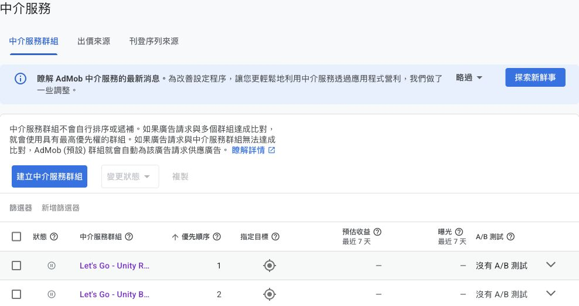

* _2026-10-07 23:54:08 +0800 (codex/unknown)_

# Unity 後台準備結果

- 兩個 AdMob Unity 中介群組已保存，均為已暫停；目前未啟用 Unity 生產供應。
- 合作夥伴關係與兩個對應在本輪接手前已存在；本輪只核對並複製對應，未接受任何條款，未操作既有 Mintegral 來源。
- 程式 Result Go 已收到；剩餘實機、CMP 地區訊號與 Unity 單一來源供應驗證，不能把後台就緒當成廣告已供應。

## 已保存群組

|群組|ID|格式／平台|廣告單元|Unity Game ID|Placement ID|狀態|
|---|---|---|---|---|---|---|
|Let's Go - Unity Banner Android|8708929545|橫幅／Android|map-ad-2|800390974|BP_Banner_Android|已暫停|
|Let's Go - Unity Rewarded Android|8676901314|獎勵／Android|no-ad-6h|800390974|BP_Rewarded_Android|已暫停|

- 範圍均為所有國家／地區；兩種格式分開，沒有相互覆蓋。各群組只保留預設 AdMob Network 與 Unity Ads 出價，未加入 Mintegral、AppLovin、waterfall、自訂事件或 A/B 測試。
- 建立時先把狀態切為已暫停，選取正確 Let's Go 單元；來源複製畫面逐一核對 Game ID／Placement ID 與有效合作夥伴，新增 Unity 後才保存。
- 兩次保存後 UI 均顯示「變更已儲存成功」、群組 ID、已暫停、正確廣告單元與 Unity 就緒／有效。列表再次顯示兩個已暫停群組，排序由 AdMob 自動配置。

## 證據

[橫幅已保存頁面上方](banner-paused.jpg)顯示群組名稱、ID8708929545、橫幅／Android及已暫停；map-ad-2與AdMob／Unity來源由該保存頁的可見UI／AX核對，未宣稱都出現在這張截圖。

[獎勵已保存頁面上方](rewarded-paused.jpg)顯示群組名稱、ID8676901314、獎勵／Android及已暫停；no-ad-6h與AdMob／Unity來源由該保存頁的可見UI／AX核對，未宣稱都出現在這張截圖。

- 初次詳細截圖只拍到下方來源區，無法支持先前對ID／單元／狀態的圖片描述；獨立review指出後，已在已保存群組的edit頁重新核對並補拍上方截圖。原圖片與BLOCKING報告保留於Git history，後台設定未再修改。
- 列表截圖只保存本次群組及周圍操作脈絡；不包含帳戶聯絡資料或其他群組收益。
- 本輪未改 App source；沿用 7fa932f 的 269 tests、三項 Gradle、34 個既有 lint Error 無新增與安全／程式驗收證據，沒有重跑未失效的套件。
- 使用者A-003明確回覆「- 先保留待驗證」；本輪 adb devices 再查仍無裝置，實機測試延期，沒有背景测试。CMP 後台地區設定、真實訊號送達、Unity 單一來源 banner／rewarded、map/mock smoke 與實際供應仍未驗證。

## 設定

- 使用者原文：auto-reply: on；away-gates: on；streams: off。
- 設定工具已寫入 .agentflow/features/unity-ads/ag.json 並驗證有效；Git diff 僅改這三個值，其餘設定保持。適用目前 stream，既有 worktree 繼續使用。
- away-gates 自動門檻只適用已驗證的開發工作；不能替代實機證據或接受法律條款。

Self-check: 已核對兩次保存成功與最後列表、正確單元和 Unity mapping、暫停／非生產狀態、Mintegral 排除、三項設定及保留的實機限制；本文件僅記錄本輪觀察，不宣稱完整供應。
